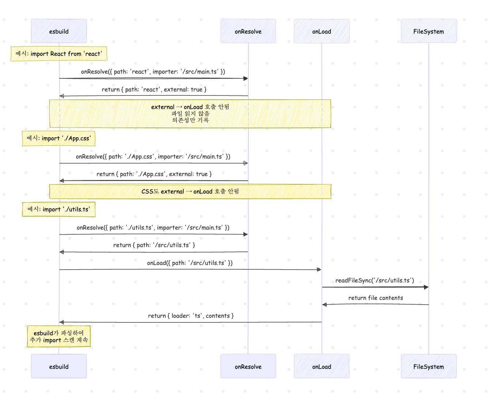

# 들어가면서

꽤나 익숙한 문제를 마주 했습니다. not found module에 대한 에러였는데, 스택트레이싱을 통해 정확한 지점을 파악하기 위해 재현을 두번 이상 반복하면서 서로 다른 지점의 스택 트레이스를 내어주고 있었습니다. 때문에 혼란스러움에 코드를 뜯어 보게 되었습니다. 

이글을 통해 챙겨가실 수 있는 점 : 

1. not found moudle를 마주했을때 알고있던 이론으로 풀어가는게 아닌 정확하게 어딘지를 알아낼 수 있습니다(특히 vite가 어떻게 )
2. 공식문서의 prebundling에 대한 부분이 esbuild 덕분에 빠르다고는 하지만,구체적으로 vite가 esbuild를 어떻게 이용하고 있는지 어떤부분에서 왜 빠른지?를 소스코드 분석을 통해 알 수 있습니다.(esbuild go코드분석은 제외)
3. npm run vite 부터 localhost가 나오기 전까지 과정을 알 수 있습니다.

캐시 부분이라던지, 일부라이브러리는 prebuild가 안되는 이유라던지 등 해당과정과 연결될 토픽들이 많이 있었지만 방대한 내용들을 나누어서 기고할 예정입니다.


글의 개요

- 전체적인 흐름 따라잡기
  - CLI 엔트리 확인 
  - 
  - prepareEsbuildScanner
  - resolvePackageEntry
- 디버깅하는과정에서 들었던 의문:vite가 prebundling 을 빠르게 처리한다? prebundling 때문에 vite가 빠르다?

- prebundling에선 왜 굳이 esbuild를 사용했을까? 
- 
- 
## 전체 흐름 한눈에 보기
 Vite의 dependency pre-bundling은 개발 서버 시작 시 CommonJS/UMD 모듈을 ESM으로변환하고 여러 파일을 하나로 합쳐서 HTTP 요청 수를 줄이는 핵심 최적화입니다.
  esbuild의 Go 기반 성능을 활용합니다.
  prebuild가 언제 어떤 조건에서 실행하는지 알아보겠습니다. 


저는 Vite가 prebundling을 처리하는 과정을 크게 CLI 시작 → 의존성 스캔 → prebundle 실행 → 개발 서버 구동 의 단계로 나누었습니다.

### 1.CLI 엔트리 확인 
개발환경에서는 ./server에 있는 모듈을 통해 인스턴스를 생성합니다.
`cli.ts`를 보면 `cac`이라는 CLI 라이브러리를 사용해서 명령어와 옵션을 파싱합니다.

`vite`만 입력하면 → `createServer`가 실행되어 **개발 서버 모드**로 진입합니다. `vite build`를 입력하면 → `build` 함수가 실행되어 **Rollup 기반 빌드 모드**로 동작합니다.

![cli.build]
![cli.build.rollup]


### 2. createServer : override httpServer.listen

prebuild는 서버가 리스닝 하기전 시작됩니다. 이 부분을 확언 할 수 있는게,httpServer.listen을 오버라이드 해서 강제를 보장하기 때문에, 서버가 리스닝하기 전에 반드시 prebuild 과정이 시작됩니다.


(DEBUG=vite:deps npm run dev) 로 실행 
구체적으로 코드를 분석해서 어떻게 지연시키는지 보겠습니다.

```tsx
//  server/index.ts:988-998:

export async function _createServer(
  inlineConfig: InlineConfig | ResolvedConfig = {},
  options: {
    listen: boolean
    previousEnvironments?: Record<string, DevEnvironment>
  },
): Promise<ViteDevServer> {

  ...
  ...
  ...


  if (!middlewareMode && httpServer) {
    // overwrite listen to init optimizer before server start
    const listen = httpServer.listen.bind(httpServer)

    httpServer.listen = (async (port: number, ...args: any[]) => {
      try {
        await initServer(true)  //✅ prebuild 시작점 
      } catch (e) {
        httpServer.emit('error', e)
        return
      }
      return listen(port, ...args) //✅ 실제 서버가 시작되는곳
    }) as any
  } else {
    await initServer(false)
  }

  return server
}

```

Node.js HTTP 서버의 listen() 메서드는 본래 동기적으로 포트를 바인딩하는데, Vite는 이를 비동기로 감싸서 prebuild가 완료될 때까지 실제 리스닝을 지연시킵니다. await가 있으니 initServer()가 성공하면 return listen()으로 원래 original서버가 시작 되고, 실패시에는 `httpServer.emit('error', e)` 가 실행 됩니다. 


### initServer

Vite에는 다양한 실행환경을 Environment라는 클래스의 인스턴스로 관리합니다. 
기본적으로 client와 ssr인 서버사이드 렌더링 환경이 있습니다. 

```tsx
// server/index.ts:976-978:

  await Promise.all(

  Object.values(environments).map((e) 
  => e.listen(server)), ✅ 다음 호출
  )
```

### Environment.listen() 호출 


```typescript
export class DevEnvironment extends BaseEnvironment{
  mode = 'dev' as const
  moduleGraph: EnvironmentModuleGraph
  depsOptimizer?: DepsOptimizer

  ...
  ...
  ...


  /**
  /**
   * When the dev server is restarted, the methods are called in the following order:
   * - new instance `init`
   * - previous instance `close`
   * - new instance `listen`
   */
  async listen(server: ViteDevServer): Promise<void> {
    this.hot.listen()
    await this.depsOptimizer?.init() // ✅ 
    warmupFiles(server, this)
  }
}

export interface DepsOptimizer {
  init: () => Promise<void>

  metadata: DepOptimizationMetadata
  scanProcessing?: Promise<void>
  registerMissingImport: (id: string, resolved: string) => OptimizedDepInfo
  run: () => void

  isOptimizedDepFile: (id: string) => boolean
  isOptimizedDepUrl: (url: string) => boolean
  getOptimizedDepId: (depInfo: OptimizedDepInfo) => string

  close: () => Promise<void>

  options: DepOptimizationOptions
}

```


### DepsOptimizer.init() 실행 : 스캔 프로세스 시작 

여기서부터 의존성들의 스캔이 일어납니다. vite.config.js 내 사용자가 명시적으로 등록한 optimizeDeps.include옵션을 먼저 처리합니다. 

```tsx

 let inited = false
  async function init() {
    if (inited) return
    inited = true

    const cachedMetadata = await loadCachedDepOptimizationMetadata(environment) //캐시 데이터 확인 

    firstRunCalled = !!cachedMetadata

    metadata = depsOptimizer.metadata =
      cachedMetadata || initDepsOptimizerMetadata(environment, sessionTimestamp)

    if (!cachedMetadata) { //만약 없으면 
      waitingForCrawlEnd = true

      // Enter processing state until crawl of static imports ends
      currentlyProcessing = true

      // Initialize discovered deps with manually added optimizeDeps.include info

      const manuallyIncludedDeps: Record<string, string> = {}
      await addManuallyIncludedOptimizeDeps(environment, manuallyIncludedDeps) //사용자가 vite.config.js의 optimizeDps.include에 작성한 옵션 처리 

      const manuallyIncludedDepsInfo = toDiscoveredDependencies(
        environment,
        manuallyIncludedDeps,
        sessionTimestamp,
      )
      
      for (const depInfo of Object.values(manuallyIncludedDepsInfo)) {
        addOptimizedDepInfo(metadata, 'discovered', {
          ...depInfo,
          processing: depOptimizationProcessing.promise,
        })
        newDepsDiscovered = true
      }

      environment.waitForRequestsIdle().then(onCrawlEnd)

      if (noDiscovery) {
        // We don't need to scan for dependencies or wait for the static crawl to end
        // Run the first optimization run immediately
        runOptimizer()
      } else {
        // Important, the scanner is dev only
        depsOptimizer.scanProcessing = new Promise((resolve) => {
          // Runs in the background in case blocking high priority tasks
          ;(async () => {
            try {
              debug?.(colors.green(`scanning for dependencies...`))

              let deps: Record<string, string>
              try {
                discover = discoverProjectDependencies(
                  devToScanEnvironment(environment), // HTML/JS 파일들을 esbuild로 스캔
                )
                deps = await discover.result // 
                discover = undefined
              } catch (e) {
                environment.logger.error(
                  colors.red(
                    '(!) Failed to run dependency scan. ' +
                      'Skipping dependency pre-bundling. ' +
                      e.stack,
                  ),
                )
                return
              }

              const manuallyIncluded = Object.keys(manuallyIncludedDepsInfo)
              discoveredDepsWhileScanning.push(
                ...Object.keys(metadata.discovered).filter(
                  (dep) => !deps[dep] && !manuallyIncluded.includes(dep),
                ),
              )

              // Add these dependencies to the discovered list, as these are currently
              // used by the preAliasPlugin to support aliased and optimized deps.
              // This is also used by the CJS externalization heuristics in legacy mode
              for (const id of Object.keys(deps)) {
                if (!metadata.discovered[id]) { 
                  addMissingDep(id, deps[id])
                }
              }

              const knownDeps = prepareKnownDeps()
              startNextDiscoveredBatch()

              // For dev, we run the scanner and the first optimization
              // run on the background
              optimizationResult = runOptimizeDeps(environment, knownDeps)

              // If the holdUntilCrawlEnd strategy is used, we wait until crawling has
              // ended to decide if we send this result to the browser or we need to
              // do another optimize step
              if (!holdUntilCrawlEnd) {
                // If not, we release the result to the browser as soon as the scanner
                // is done. If the scanner missed any dependency, and a new dependency
                // is discovered while crawling static imports, then there will be a
                // full-page reload if new common chunks are generated between the old
                // and new optimized deps.
                optimizationResult.result.then((result) => {
                  // Check if the crawling of static imports has already finished. In that
                  // case, the result is handled by the onCrawlEnd callback
                  if (!waitingForCrawlEnd) return

                  optimizationResult = undefined // signal that we'll be using the result

                  runOptimizer(result)
                })
              }
            } catch (e) {
              logger.error(e.stack || e.message)
            } finally {
              resolve()
              depsOptimizer.scanProcessing = undefined
            }
          })()
        })
      }
    }
  }

```


### discoverProjectDependencies


```tsx
/**
 * Initial optimizeDeps at server start. Perform a fast scan using esbuild to
 * find deps to pre-bundle and include user hard-coded dependencies
 */
export function discoverProjectDependencies(environment: ScanEnvironment): {
  cancel: () => Promise<void>
  result: Promise<Record<string, string>>
} {
  const { cancel, result } = scanImports(environment)

  return {
    cancel,
    result: result.then(({ deps, missing }) => {
      const missingIds = Object.keys(missing)
      if (missingIds.length) {
        throw new Error(
          `The following dependencies are imported but could not be resolved:\n\n  ${missingIds
            .map(
              (id) =>
                `${colors.cyan(id)} ${colors.white(
                  colors.dim(`(imported by ${missing[id]})`),
                )}`,
            )
            .join(`\n  `)}\n\nAre they installed?`,
        )
      }

      return deps
    }),
  }
}


```
### scanImport 

```tsx
async function scan() {
    const entries = await computeEntries(environment)
    if (!entries.length) {
      if (!config.optimizeDeps.entries && !config.optimizeDeps.include) {
        environment.logger.warn(
          colors.yellow(
            '(!) Could not auto-determine entry point from rollupOptions or html files ' +
              'and there are no explicit optimizeDeps.include patterns. ' +
              'Skipping dependency pre-bundling.',
          ),
        )
      }
      return
    }
    if (scanContext.cancelled) return

    debug?.(
      `Crawling dependencies using entries: ${entries
        .map((entry) => `\n  ${colors.dim(entry)}`)
        .join('')}`,
    )
    const deps: Record<string, string> = {}
    const missing: Record<string, string> = {}

    let context: BuildContext | undefined
    try {
      esbuildContext = prepareEsbuildScanner(
        environment,
        entries,
        deps,
        missing,
      )
      context = await esbuildContext
      if (scanContext.cancelled) return

      try {
        await context!.rebuild()
        return {
          // Ensure a fixed order so hashes are stable and improve logs
          deps: orderedDependencies(deps),
          missing,
        }
      } catch (e) {
        if (e.errors && e.message.includes('The build was canceled')) {
          // esbuild logs an error when cancelling, but this is expected so
          // return an empty result instead
          return
        }

        const prependMessage = colors.red(`\
  Failed to scan for dependencies from entries:
  ${entries.join('\n')}

  `)
        if (e.errors) {
          const msgs = await formatMessages(e.errors, {
            kind: 'error',
            color: true,
          })
          e.message = prependMessage + msgs.join('\n')
        } else {
          e.message = prependMessage + e.message
        }
        throw e
      } finally {
        if (debug) {
          const duration = (performance.now() - start).toFixed(2)
          const depsStr =
            Object.keys(orderedDependencies(deps))
              .sort()
              .map((id) => `\n  ${colors.cyan(id)} -> ${colors.dim(deps[id])}`)
              .join('') || colors.dim('no dependencies found')
          debug(`Scan completed in ${duration}ms: ${depsStr}`)
        }
      }
    } finally {
      context?.dispose().catch((e) => {
        environment.logger.error('Failed to dispose esbuild context', {
          error: e,
        })
      })
    }
  }
  const result = scan()

  return {
    cancel,
    result: result.then((res) => res ?? { deps: {}, missing: {} }),
  }
```


### prepareEsbuildScanner

react파일에서 import 구문을 찾는 곳은 esbuildScanPlugin의 핵심 부분입니다.여기서부터 esbuild와의 상호작용이 이루어 집니다. 
vite는 esbuild의 플러그인 시스템인 vite만의  vite:dep-scan을 만들어, esbuild의 context를 활용해 플러그인을 등록합니다.

```typescript
async function prepareEsbuildScanner(environment, entries, deps, missing) {
  // 1. vite:dep-scan 플러그인 생성
  const plugin = esbuildScanPlugin(environment, deps, missing, entries);
  


  // 2. esbuild context 생성
  const context = await esbuild.context({
    plugins: [plugin],  // ← vite:dep-scan 플러그인 등록
    // ... 기타 esbuild 옵션
  });
  
  return context;
}

```

vite가 esbuild위에 자신의 로직(플러그인)을 추가합니다. 

`esbuildScanPlugin` 을 호출하여 vite:dep-scan 플러그인을 생성합니다.
그러니깐, Plugin이라는 타입을 반환하기 때문에 이자체가 플러그인입니다. 실제 내부 소스코드엔 vite:dep-scan이라는 이름을 가진 Plugin을 반환합니다.


```typescript {}

function esbuildScanPlugin(){

  ...


 // bare imports: record and externalize ----------------------------------
      build.onResolve(
        {
          // avoid matching windows volume
          filter: /^[\w@][^:]/,
        },
        async ({ path: id, importer }) => {
          if (moduleListContains(exclude, id)) {
            return externalUnlessEntry({ path: id })
          }
          if (depImports[id]) {
            return externalUnlessEntry({ path: id })
          }
          const resolved = await resolve(id, importer)
          if (resolved) {
            if (shouldExternalizeDep(resolved, id)) {
              return externalUnlessEntry({ path: id })
            }
            if (isInNodeModules(resolved) || include?.includes(id)) {
              // dependency or forced included, externalize and stop crawling
              if (isOptimizable(resolved, optimizeDepsOptions)) {
                depImports[id] = resolved
              }
              return externalUnlessEntry({ path: id })
            } else if (isScannable(resolved, optimizeDepsOptions.extensions)) {
              const namespace = htmlTypesRE.test(resolved) ? 'html' : undefined
              // linked package, keep crawling
              return {
                path: path.resolve(resolved),
                namespace,
              }
            } else {
              return externalUnlessEntry({ path: id })
            }
          } else {
            missing[id] = normalizePath(importer)
          }
        },
      )
}


```

이제 이때 부터는 esbuild-vite간의 상호작용입니다. esbuild가 import문을 만나면, 등록된 build.onResolve 훅이 실행됩니다.


문법적으로 좀 더 분석해 보자면, 

```typescript 

// esbuild 타입 정의
interface PluginBuild {
  onResolve(options: OnResolveOptions, callback: OnResolveCallback): void;
  //  ↑           ↑                    ↑
  //  함수명    첫번째 파라미터        두번째 파라미터 (진짜 콜백)
}

// 실제 사용 코드
build.onResolve({ filter: /.*/ }, callbackFunction);
//    ↑         ↑                 ↑  
//   함수 호출   옵션 객체         콜백 함수 (파라미터로 전달)

```

해당 패턴은 DOM이벤트 리스너와 같은 패턴입니다. 


```typescript
// DOM 이벤트 리스너 
button.addEventListener('click', clickHandler);
//     ↑               ↑        ↑
//    함수 호출       이벤트타입   콜백함수

// esbuild onResolve (같은 패턴!)
build.onResolve({ filter: /.*/ }, resolveHandler);
//    ↑         ↑                 ↑
//   함수 호출   옵션 객체         콜백함수


```


build.onResolve를 등록하고 콜백호출은 esbuild 에게 주도권이 있습니다. 그래서 여기서부터는 esbuild 에서 진행됩니다. 


이러한 패턴으로 build.onResolve() 통해 메모리에 등록만 해두고 esbuild 스캔 중 filter 패턴을 만나면, resolveHandler를 트리거합니다. 이때 주도권이 vite 에게로 갑니다.

vite에서 실제 모듈을 확인하고 처리합니다. 

{
    path: string;
    external: boolean;
} 
형태로 반환되는데 이때 주도권이 다시 esbuild로 돌아갑니다. 





```typescript

 return {
    name: 'vite:dep-scan',
    setup(build) {
      const scripts: Record<string, OnLoadResult> = {}

      // external urls
      build.onResolve({ filter: externalRE }, ({ path }) => ({
        path,
        external: true,
      }))

      // data urls
      build.onResolve({ filter: dataUrlRE }, ({ path }) => ({
        path,
        external: true,
      }))

      // local scripts (`<script>` in Svelte and `<script setup>` in Vue)
      build.onResolve({ filter: virtualModuleRE }, ({ path }) => {
        return {
          // strip prefix to get valid filesystem path so esbuild can resolve imports in the file
          path: path.replace(virtualModulePrefix, ''),
          namespace: 'script',
        }
      })

      build.onLoad({ filter: /.*/, namespace: 'script' }, ({ path }) => {
        return scripts[path]
      })

      // html types: extract script contents -----------------------------------
      build.onResolve({ filter: htmlTypesRE }, async ({ path, importer }) => {
        const resolved = await resolve(path, importer)
        if (!resolved) return
        // It is possible for the scanner to scan html types in node_modules.
        // If we can optimize this html type, skip it so it's handled by the
        // bare import resolve, and recorded as optimization dep.
        if (
          isInNodeModules(resolved) &&
          isOptimizable(resolved, optimizeDepsOptions)
        )
          return
        return {
          path: resolved,
          namespace: 'html',
        }
      })


```


  // importer = "/project/src/main.js"
예를 들어  path가 "./App.vue" 인경우, esbuild를 통
  // "vue" → "/project/node_modules/vue/dist/vue.esm-bundler.js"로 해결

### 왜 esbuild가 필요했을까? esbuild의 빠른 스캔 능력과 Vite의 모듈 해석 로직

지금까지 흐름을 살펴보았습니다. 여기까지 보면서 전 의문이 있었는데요. 왜 굳이 esbuild를 사용할까 였습니다. 왜냐하면 vite가 onResolve의 콜백함수에서 node_modules인지 확인하는 절차까지 처리해 효용성이 크다고 생각하지 않았기 때문입니다. 

그런데 다시 디버깅하는 과정에서 vite가 esbuild에게 넘겨줄 때 진입점만 준다는걸 알게되었습니다. 


다시 함수로 돌아가겠습니다. 

```typescript

 return {
    name: 'vite:dep-scan',
    setup(build) {
      const scripts: Record<string, OnLoadResult> = {}

      // external urls
      build.onResolve({ filter: externalRE }, ({ path }) => ({
        path,
        external: true,
      }))

      // data urls
      build.onResolve({ filter: dataUrlRE }, ({ path }) => ({
        path,
        external: true,
      }))

      // local scripts (`<script>` in Svelte and `<script setup>` in Vue)
      build.onResolve({ filter: virtualModuleRE }, ({ path }) => {
        return {
          // strip prefix to get valid filesystem path so esbuild can resolve imports in the file
          path: path.replace(virtualModulePrefix, ''),
          namespace: 'script',
        }
      })

      build.onLoad({ filter: /.*/, namespace: 'script' }, ({ path }) => {
        return scripts[path]
      })

      // html types: extract script contents -----------------------------------
      build.onResolve({ filter: htmlTypesRE }, async ({ path, importer }) => {
        const resolved = await resolve(path, importer)
        if (!resolved) return
        // It is possible for the scanner to scan html types in node_modules.
        // If we can optimize this html type, skip it so it's handled by the
        // bare import resolve, and recorded as optimization dep.
        if (
          isInNodeModules(resolved) &&
          isOptimizable(resolved, optimizeDepsOptions)
        )
          return
        return {
          path: resolved,
          namespace: 'html',
        }
      })


```


https://esbuild.github.io/plugins/#using-plugins 공식문서를 참고하면, 
해당 코드에서 사용한 namespaces, filters, On-resolve callbacks에 대한 설명이 있습니다.

여기서 onResolve의 설명에도 있듯이 많은 콜백들이 동시에 실행될 수 있다는걸 미루어보아 ("many callbacks may be running concurrently")병렬로 실행되고 있음을 알 수 있습니다. esbuild 는 JS로 구현되지 않고 go를 사용하기에 멀티스레드의 장점을 활용해  


prepareEsBuildScanner의 목적은 의존성 사전 번들링(dependency pre-bundling)을 위한 스캔입니다. 즉 개발 서버 시작 전에 의존성을 미리 파악하고 번들링을 합니다.


// 1. 프로젝트의 모든 의존성 찾기
const deps = {
  'vue': '/node_modules/vue/dist/vue.esm-bundler.js',
  'lodash': '/node_modules/lodash-es/lodash.js',
  'axios': '/node_modules/axios/dist/axios.js',
  // ... 모든 의존성들
}

문제는 이 의존성들이 한두개가 아니라 수백개의 파일을 빠르게 스캔해야 한다는 점입니다. esbuild의 파싱속도가 훨


esbuild는 내부적으로 stdin의 `contents` 를  파싱합니다.
import로 구성된 contents들을 하나씩 순회하며 resolve 콜백을 실행시키고, 
vite가 resolve를 수행 후 리턴된 결과 경로를 이용해 파일을 로드 합니다. 


```typescript 
//stdin강조하기

  return await esbuild.context({
    absWorkingDir: process.cwd(),
    write: false,
    stdin: {
      contents: entries.map((e) => `import ${JSON.stringify(e)}`).join('\n'),
      loader: 'js',
    },
    bundle: true,
    format: 'esm',
    logLevel: 'silent',
    plugins: [...plugins, plugin],
    jsxDev: !environment.config.isProduction,
    ...esbuildOptions,
    tsconfigRaw,
  })

````


esbuild가 모듈 하나씩 발견할 때마다 Vite에게 "이거 어떻게 처리할까?"라고 묻고, Vite가 bareImportRE 정규식으로 판단해서 node_modules 패키지면 pre-bundle 목록에 추가하는 방식이죠.

bare import가 왜 runOptimize를 거쳐야 할까?

<여기에 공식문서 The Why> 가 의미하는 부분이 바로 여기 입니다. 

브라우저의 native ESM은 상대경로나 절대 URL만 이해합니다.
해결: Vite가 bare import를 실제 파일 경로로 변환해줘야 함.


```typescript

// ❌ 브라우저는 react가 무엇인지 어디에있는지 모름 
import React from 'react'

// ✅ 브라우저가 이해할 수 있는 형태
import React from '/node_modules/.vite/deps/react.js?v=f3sf2ebd'

```

CommonJS → ESM 변환 필요
브라우저는 require(), module.exports 를 모름.
해결: esbuild가 CommonJS를 ESM으로 변환.

```typescript

// 많은 npm 패키지들이 아직 CommonJS 형태
// node_modules/some-package/index.js
module.exports = {
  foo: 'bar'
}

// 브라우저는 ESM만 지원
// 변환 후: /node_modules/.vite/deps/some-package.js
export default {
  foo: 'bar'
}

```


이 의존성들을 미리 번들링하게 되면 개발서버 시간을 단축할 수 있고, 브라우저에서는 빠른 로딩을 부르며, commonJS 는 ESM으로 변환됩니다. 


Vite는 먼저 애플리케이션의 모듈을 종속성과 소스 코드의 두 가지 범주로 나누어 개발 서버 시작 시간을 개선합니다.
-> 이 문장을 대변할 수 있는 소스코드

종속성은 대부분 개발 중에 자주 변경되지 않는 일반 JavaScript입니다. 일부 대규모 종속성(예: 수백 개의 모듈이 있는 구성 요소 라이브러리)도 처리 비용이 상당히 많이 듭니다. 종속성은 다양한 모듈 형식(예: ESM 또는 CommonJS)으로 제공될 수도 있습니다.

페이지 로딩 속도를 개선하고 CommonJs/UMD모듈을 ESM으로 변환하기위해 사전 번들링합니다. 
사전번들링 단계는 esbuild를 통해 수행되며 Vite의 콜드 스타트 시간을 다른 JavaScript번들러보다 훨씬 빠르게 만듭니다. 

Vite는 esbuild를 사용하여 종속성을 사전 번들로 묶습니다. esbuild는 Go로 작성되었으며 JavaScript 기반 번들러보다 10-100배 빠르게 종속성을 사전 번들링합니다.


소스 코드에는 변환이 필요한 일반 JavaScript가 아닌 JavaScript(예: JSX, CSS 또는 Vue/Svelte 구성 요소)가 포함되는 경우가 많으며 매우 자주 편집됩니다. 또한 모든 소스 코드를 동시에 로드할 필요는 없습니다(예: 경로 기반 코드 분할 사용).

Vite는 기본 ESM을 통해 소스 코드를 제공합니다. 이것은 본질적으로 브라우저가 번들러 작업의 일부를 인수하도록 하는 것입니다: Vite는 브라우저가 요청할 때 필요에 따라 소스 코드를 변환하고 제공하기만 하면 됩니다. 조건부 동적 가져오기 코드 숨김은 현재 화면에서 실제로 사용되는 경우에만 처리됩니다.


### resolvePackageEntry - 실패지점

resolvePackageEntry에서 실패하는 주요 원인은 modern 
package.json의 exports 필드와 legacy mainFields 간의 
충돌입니다. "패키지는 설치되어 있는데 왜 못 찾지?" 라고 고민한다면, 패키지 진입점 해석 방식의 변화 때문입니다.


## 뭐가 맞는 말일까?

“Vite가 prebundling을 빠르게 처리한다” → ✅ 맞음
왜냐하면 esbuild를 활용해서 prebundling 자체가 엄청 빠름 (Go + 멀티스레드 기반 파서).
“prebundling 때문에 Vite가 빠르다” → ✅ 맞음 (하지만 부분적으로만)
Vite가 빠른 여러 이유 중 하나가 prebundling 최적화 덕분임.
하지만 진짜 큰 이유는 ESM 기반 아키텍처에 있음.
즉, 정확히 말하면 이렇게 요약할 수 있어요:
Vite가 빠른 근본 이유는 전체 번들을 생략하고 ESM 기반으로 on-demand 제공하기 때문이고, prebundling은 그 구조에서 발생할 수 있는 병목(수많은 의존성 import)을 esbuild로 빠르게 해결하는 최적화 단계다.

## Caching

공식 문서에 해당하는 내용입니다. 


## Why not Bundle with esbuild?

공식문서에 있는 내용입니다. "Vite의 현재 플러그인 API는 esbuild를 번들러로 사용하는 것과 호환되지 않습니다. esbuild가 더 빠르다는 점에도 불구하고 Vite는 Rollup의 유연한 플러그인 API 및 인프라를 채택하여 생태계에서의 성공에 크게 기여했습니다."


## 배운점 및 마무리

"각 도구가 잘하는 일을 분담시켰어요",
    "esbuild: 빠른 스캔 + 패턴 매칭",  
    "Vite: 복잡한 모듈 해석 + 유연한 처리",
    "이런 방식으로 성능과 기능성을 모두 확보했습니다",

이런 접근법으로 내가한 프로젝트에서도 비슷하게 적용할 수 
패턴을 이해하고 → 일반화하고 → 다른 상황에 적용할 수 있도록 하고싶다. 

이번 코드를 뜯어보면서 여러 레퍼런스를 참조하면서 상당수의 내용이 공식문서 [Why Vite](https://vite.dev/guide/why) 
파트를 단순히 vite는 esbuild가 빠르니깐 이라고 생각했던 부분을 어떤 부분에서? vite와 esbuild가 호환하며 전담한 부분들을 더 잘 이해할 수 있었습니다. 


```sequenceDiagram
sequenceDiagram
    participant ESB as esbuild
    participant OR as onResolve
    participant OL as onLoad
    participant FS as FileSystem

    Note over ESB: 예시: import React from 'react'

    ESB->>OR: onResolve({ path: 'react', importer: '/src/main.ts' })
    OR->>ESB: return { path: 'react', external: true }
    Note over ESB,OL: external → onLoad 호출 안됨<br/>파일 읽지 않음<br/>의존성만 기록

    %% 구분선
    Note over ESB: 예시: import './App.css'

    ESB->>OR: onResolve({ path: './App.css', importer: '/src/main.ts' })
    OR->>ESB: return { path: './App.css', external: true }
    Note over ESB,OL: CSS도 external → onLoad 호출 안됨

    %% 구분선
    Note over ESB: 예시: import './utils.ts'

    ESB->>OR: onResolve({ path: './utils.ts', importer: '/src/main.ts' })
    OR->>ESB: return { path: '/src/utils.ts' }
    ESB->>OL: onLoad({ path: '/src/utils.ts' })
    OL->>FS: readFileSync('/src/utils.ts')
    FS->>OL: return file contents
    OL->>ESB: return { loader: 'ts', contents }
    Note over ESB: esbuild가 파싱하여<br/>추가 import 스캔 계속


```
