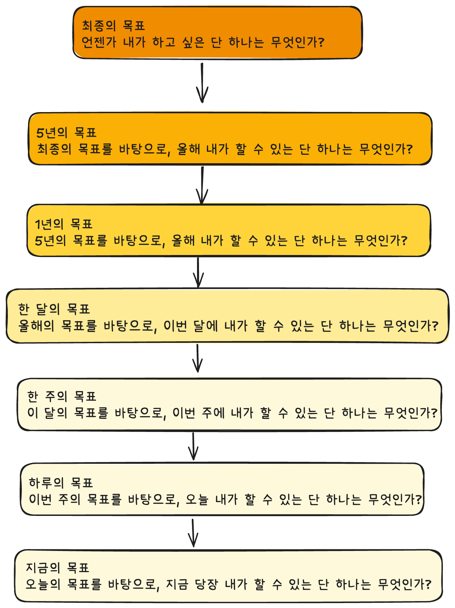

- 계획의 오류 보완하기 -> 과정을 시각화 하기
- 최종의 목표를 이루기 위해 앞으로 5년 내에 내가 할 수 있는 단하나는 무엇인가?
- 도전 -> 목적의식으로 이동 : 
시간 확보하기에서 최대한 많은 것을 어덩내려면 자신의 일하는 방식을 지속적으로 개선하는 일이
중요하다.
- 미래의 목적의식이 현재의 우선순위와 이어지게 하기

### 현재에 근거한 목표 설정

