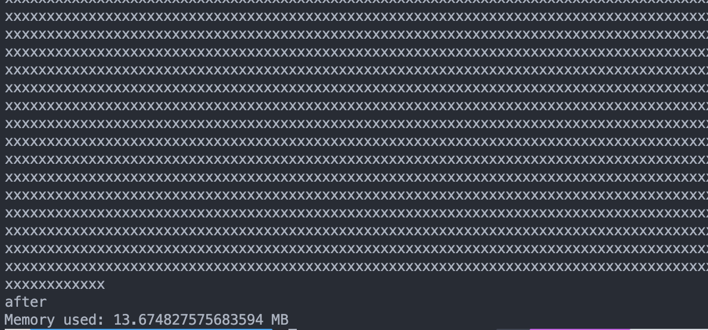
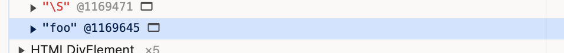

## 들어가면서

:::note
주의: 이 글은 개인적인 탐구 과정을 담은 것으로, 일부 기술적 용어나 설명이 정확하지 않을 수 있다. JavaScript 엔진의 메모리 관리는 매우 복잡한 주제이며, 여기서는 제한된 실험을 통해 관찰된 내용을 다룬다.
:::

이 탐구의 배경은 내가 알고있던 참조형의 정의 그러니깐 메모리에 저장된 값을 참조하는 데이터타입. 변수가 데이터의 실제값이 아닌 메모리 주소를 저장 하고 여기엔 객체, 배열, 함수가 해당된다 라고 생각했다.

재형님의 자바스크립트 코어 책에는 자바스크립트 참조에는 기본형도 포함된다는 것이다.

1. 기본형은 스택에, 참조형은 힙에 할당된다 (일반적으로 내가 알고 있는 개념)
2. JavaScript의 모든 것이 참조형이다 (책의 주장)
3. 따라서 JavaScript의 모든 것이 힙에 할당될까? 
<br><br>

---

## 메모리 할당 실험: 기본형 데이터는 어디에 저장되는가?

먼저 V8 엔진의 스택 크기를 확인해보자.


기본적으로 864KB가 할당된다.


이제 문자열 할당 실험을 통해 기본형 데이터의 메모리 할당을 확인해보자.

```javascript
const MB = 1024 * 1024; // 1MB 단위 정의

function memoryUsed() {
    const mbUsed = process.memoryUsage().heapUsed / 1024 / 1024;
    console.log(`힙 메모리 사용량: ${mbUsed} MB`);
}
const bigString = "x".repeat(10 * MB); // 10MB 문자열 생성
console.log(bigString.length); // 컴파일러 최적화 방지

console.log("할당 전");
memoryUsed();

console.log("할당 후");
memoryUsed();


```

실행 결과:

- 할당 전: 3MB


- 할당 후: 13MB


힙 메모리 사용량이 정확히 10MB 증가했다. V8의 스택 크기가 864KB인 점을 고려하면, 이 큰 문자열은 힙에 할당되었음을 알 수 있다.

<br><br>

## 문자열 인터닝: V8의 문자열 최적화

같은 문자열을 여러 변수에 할당하면 어떻게 될까? Chrome DevTools를 통해 확인해보자.

```javascript
const btn = document.querySelector("#btn");

btn.addEventListener("click", () => {
    const string1 = "foo";
    const string2 = "foo";
});
```



버튼을 클릭했을 때 `foo`라는 문자열을 담은 변수가 2개 있으니 (string1, string2) 메모리를 할당하는 곳이 두 개이지 않을까 하지만 같은 문자열 데이터를 여러 번 메모리에 저장하는 대신 단일 복사본을 생성하고 여러 참조가 같은 데이터를 가리키도록 하는 방식으로 작동한다. V8 엔진은 문자열 인턴(string interning)이라는 최적화 기법을 사용한다. 동일한 문자열에 대해 여러 복사본을 만드는 대신, 하나의 복사본만 생성하고 여러 참조가 이를 가리키도록 한다. DevTools에서 'foo' @1169645라는 단일 메모리 주소를 확인할 수 있다.

그리고 참고한 자료에서는 실제 v8코드를 통해 variable들이 대부분 pointers라고 표현한다.

> JavaScript variables are (mostly) pointers

그 이유는 V8소스 코드 내 JavaScript 프로그램에서 생성하는 변수들은 단지 힙위에 위치한 C++ 객체를 가리키는 메모리 주소라는 것이다.
undefined를 예를 들어 설명했다.

```cpp
V8_INLINE Local<Primitive> Undefined(Isolate* isolate) {
    using S = internal::Address;
    using I = internal::Internals;
    I::CheckInitialized(isolate);
    S* slot = I::GetRoot(isolate, I::kUndefinedValueRootIndex);
    return Local<Primitive>(reinterpret_cast<Primitive*>(slot));
}
```

undefined와 같은 기본값조차 내부적으로는 C++ 객체를 가리키는 메모리 주소로 구현되어 있다.
`internal::Address` 라는 타입을 사용하고 있고, 이것의 포인터를 다루고 있다는 점에서, 메모리 주소(포인터)를 다루는 코드로 유추할 수 있다.

<br><br>

## Oddball 타입의 특별한 관리(?)

V8에는 'Oddball'이라고 불리는 특별한 타입들이 있다:

```bash
Null
Undefined
True
False
Exception
EmptyString
```

이들의 특징은:

JavaScript 프로그램 실행 전에 미리 힙에 할당된다
프로그램에서 실제 사용 여부와 관계없이 항상 존재한다
각 타입당 하나의 값만 존재하며 재사용된다

따라서 우리가 코드에서 undefined나 null을 사용할 때, 실제로는 새로운 값을 만드는 것이 아니라 이미 할당된 값을 참조하는 것이다.

<br><br>

## 예외: Small Integer 최적화

모든 것에는 예외가 있는 법. 모든 기본형 데이터가 참조형처럼 동작하는 것은 아니다. V8 엔진은 성능 최적화를 위해 -231에서 231-1 범위의 정수(small integer)는 별도로 관리한다. 이러한 정수는 추가 저장소 할당 없이 직접 처리된다.

<br><br>

## 알게 된 점

1. V8 엔진은 C++로 작성되어 있다.
2. JavaScript의 데이터들은 내부적으로 C++ 객체로 표현된다.
3. 이 C++ 객체들은 힙에 위치한다.
4. avaScript 변수들은 이 C++ 객체들의 메모리 주소를 담고 있다.

:::note

가설에 대한 증명 :
"JavaScript의 모든 것이 참조형이다"라는 말은:

JavaScript에서 기본형/참조형의 구분은
실제 엔진 구현 레벨에서는 거의 모두 "참조" 형태로 다뤄진다.
이것이 "모든 데이터 타입이 참조형"이라고 말할 수 있는 이유.

- 하지만 V8의 최적화나 구현 세부사항에 따라 실제 메모리 할당은 달라질 수 있음
- small integer 같은 최적화 케이스는 예외

:::

JavaScript의 메모리 관리는 생각보다 훨씬 복잡해서 구현 세부 사항을 설명할 때에는 신중 해야 할 것 같다.

<br><br>  

---

### 참고자료

- JavaScript Memory Model Demystified, 22 JANUARY, 2022, <https://www.zhenghao.io/posts/javascript-memory#javascript-variables-are-mostly-pointers>
- Kateryna Porshnieva. _Visualised guide to memory management in JavaScript | JSHeroes 2023_, JSHeroes 2023 <https://www.youtube.com/watch?v=OG_AZnPokGw&t=510s>
