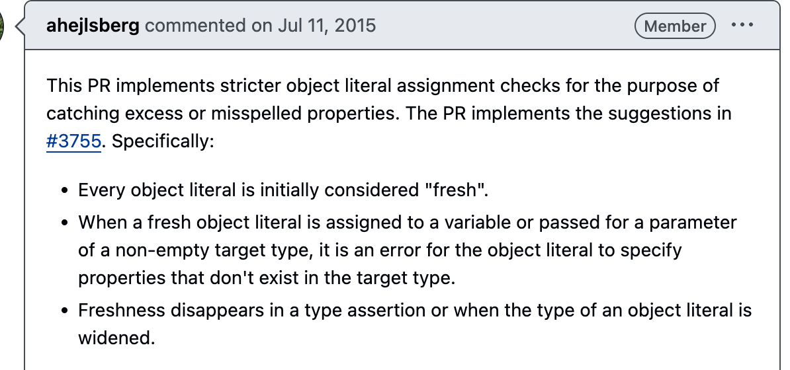

TypeScript를 쓰다 보면 이런 경험이 있다.

```typescript
type User = { name: string };

const u: User = { name: "Alice", age: 25 }; // ❌ 오류!

```

User에는 name만 필요하니깐 구조적 타이핑을 생각하고 age가 추가되어도 문제가 없을것 같지만, 오류가 난다.
그런데 이걸 변수에 한 번 저장해서 할당하면 오류가 사라진다.

```typescript
const obj = { name: "Alice", age: 25 };
const u: User = obj; // ✅ 정상 동작

```

똑같은 { name: "Alice", age: 25 } 객체인데, 왜 첫 번째 코드에서는 오류가 나고 두 번째 코드에서는 괜찮을까?

---

리서치를 하던 중 Freshness라는 개념을 접하게 되었는데, TypeScript 공식 문서에서 검색해본 결과 공식적인 용어로 사용되는 것 같지는 않았다. 다만, 몇몇 자료에서 특정 상황을 설명하기 위해 쓰이기 시작하면서 퍼진 용어로 보인다.



PR 내용에 따르면,
모든 객체 리터럴은 처음엔 "fresh(신선한)" 것으로 간주된다.
Fresh object (신선한 객체 리터럴)가 변수에 할당되거나 타입이 지정되어있는 매개변수에 전달될 때, 타입에 정의되지 않은 속성을 포함하게 되면 존재하지 않는 속성을 지정했다고 오류가 발생한다.
이 Freshness(신선함)은 객체 리터럴이 **타입 어설션**을 사용하거나 **객체 리터럴타입이 확장** 될 때 사라진다.

여기서 신선한 객체 리터럴은 타입스크립트가 객체 리터럴로부터 추론한 타입을 가리킨다.  

```typescript
let newDog:NewDog = { color: "", name: "", species: "" };

```

여기서 타입스크립트가 추론한 타입은 다음과 같다.

```typescript
{
  color: string,
  name: string,
  species: string 
};

```

이렇게 객체 리터럴이 변수에 할당된 경우 초과 속성 검사가 이루어진다.

### 신선함을 이용한 상태

```typescript
interface NewDog {
  color: string;
  name: string;
}

//객체 리터럴 직접 할당
newDog = { color: "", name: "", species: "" }; // ❌ 오류

```

`newDog`에 할당된 객체는 신선한 객체로 취급하고 타입스크립트는 초과프러퍼티 확인을 수행한 후 버그를 찾아낸다.

### 신선함이 사라진 상태(Freshness를 우회하는 방법)

#### 1.타입 어설션

```typescript

type Person = { name: string };
const p: Person = { name: "Alice", age: 25 } as Person; // ✅ 정상 동작


```

#### 2. indexed type을 통해 추가 속성 허용

```typescript
type Person = { name:string, [x:string]:any };

const b : Person= {name:"me", age:12} // ✅ 정상 동작

```

이 경우, 인덱스 시그니처을 통해 타입이 더 넓어짐으로써 freshness가 loose해졌다고 볼 수 있다.

---

이런 freshness검사는 TypeScript에서 의도적으로 한것인데, 구조적 타입 처리는 유연하면서도 편리하지만 뭔가 실제 다루는 것보다 더 많은 데이터를 받아들인다는 오해를 불러 일으킬 수 있다. [TypeScript Deep Dive 참고]("https://radlohead.gitbook.io/typescript-deep-dive/type-system/freshness")

```typescript
function logName(something: { name: string }) {
    console.log(something.name);
}

var person = { name: 'matt', job: 'being awesome' };
var animal = { name: 'cow', diet: 'vegan, but has milk of own species' };
var random = { note: `I don't have a name property` };

logName(person); // 오케이
logName(animal); // 오케이
logName(random); // 오류: 속성 `name` 누락

```

아래의 오류는 위에서 설명했듯이 freshness가 strict하게 적용된 예이다. 만약 오류가 발생하지 않는다면 `logName({ name: 'matt', job: 'being awesome' })` 라는 코드를 보는 사람은 `logName()`이 `job`에 대해서도 뭔가 처리할 것이라고 오해할 수 있다.

```typescript
function logName(something: { name: string }) {
    console.log(something.name);
}

logName({ name: 'matt' }); // ✅ 정상 동작
logName({ name: 'matt', job: 'being awesome' }); // ❌ 오류: 객체 리터럴은 정의된 속성만 지정해야 함. 여기서 `job`은 불필요.

```

이런 신선도의 좋은 예제가 있다.

```tsx
// 아래와 같을 때
interface State {
    foo: string;
    bar: string;
}

//실제 적용하고 싶은 방향:
this.setState({foo: "Hello"}); // 오류: 속성 bar 누락

// State에 `foo`와 `bar` 둘 다 있기 때문에 TypeScript에서는 이렇게 할 수 밖에 없음: 
this.setState({foo: "Hello", bar: this.state.bar});

```

여기서 Freshness를 생각해 optional로 하면 타입검사는 물론 오타도 검출이 가능하다.

```tsx
// 아래와 같을 때
interface State {
    foo?: string;
    bar?: string;
}

// 하려고 한 것: 
this.setState({foo: "Hello"}); // 좋아, 잘 되는군!

// 신선도 때문에 오타 입력은 방지됨!
this.setState({foos: "Hello"}); // 오류: 객체 리터럴은 정의된 속성만 지정해야 함

// 타입 검사도 유지됨
this.setState({foo: 123}); // 오류: 문자열에 숫자를 할당할 수 없음

```

:::note

- Freshness는 구조적 타이핑의 예외 규칙.
- TypeScript는 기본적으로 구조적 타이핑을 사용하지만,
객체 리터럴을 직접 할당할 때만 Freshness(초과 속성 검사)를 적용하여 더 엄격하게 체크한다.

💡 즉, Freshness는 구조적 타이핑을 제한하는 TypeScript의 보조 규칙이라고 볼 수 있다.

:::

## 개인적 견해  

TypeScript의 설계 철학을 보면 JavaScript의 유연함을 어느 정도 수용하면서도, 정적 타입 검사를 통해 개발자의 실수를 방지하려는 정적 타이핑 도구로서의 책임을 가져가는 것 같다. 객체 리터럴의 "신선도(Freshness)" 개념이 이런 철학을 잘 반영한 사례 인 것 같다. 반면 이런 설계 철학을 이해하지 못한 채 TypeScript를 사용하면 예상치 못한 타입 에러에 직면하거나 왜 이런 제약이 있는지 많이 혼란스러울 것 같다. 특히 구조적 타이핑과 초과 속성 검사가 상황에 따라 다르게 동작하는 이유를 이해하기 어려울 수 있다고 생각한다.TypeScript를 효과적으로 사용하기 위해서 설계 철학 이해한 후 타입 시스템의 이점을 최대한 활용할 수 있도록 하는게 중요한 것 같다.
