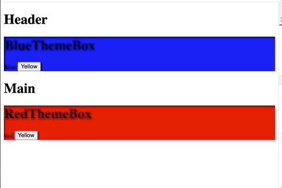

## 들어가며

코드 리뷰 스터디에서 POS 시스템을 함께 개발하던 중, 여러 컴포넌트 간에 공유되는 상태를 어떻게 관리할지에 대해 `Context`와 전역 상태 라이브러리 사이에서 다양한 논의가 오갔다.

그 과정에서 흥미로웠던 점은, **각자가 말하는 "전역 상태"의 범위와 정의가 서로 다르다는 것** 이었으며 상태에 대한 전제가 다르다 보니 설명하고자 하는 기술을 받아들이는 것도 서로 다르다는걸 알게되었다. 

이 분야에서 많은 기여를 한 다이시 카토(Daishi Kato)의 [트위터](https://x.com/dai_shi?ref_src=twsrc%5Egoogle%7Ctwcamp%5Eserp%7Ctwgr%5Eauthor)와 [마이크로 상태관리 저서](https://github.com/PacktPublishing/Micro-State-Management-with-React-Hooks) 등을 참고해, 전역 상태의 개념과 전역상태관리를 실현하기 위한 방법들을 실제 코드로 구현하며 동작원리 중심으로 리액트 생태계에서 상태 관리를 어떻게 바라보고 활용할 수 있을지 내 관점을 다시 한번 정리해 보았다. 


## 전역 상태란 무엇일까?

리액트 애플리케이션에서 상태는 일반적으로 컴포넌트 내부에서 관리되는 **지역(Local) 상태**로 시작한다. 하지만 상태가 여러 컴포넌트에서 **공유**되어야 하는 경우,이를 **전역(Global) 상태**라고 볼 수 있다.

전역 상태를 구성하는 방식에는 여러 가지가 있지만, 크게 아래 두 가지로 나눌 수 있는데,

1. **싱글턴 전역 상태**
    
    하나의 전역 상태 인스턴스를 여러 컴포넌트가 공유한다. 
    
2. **비싱글턴 전역 상태 (동적 공유 상태)**
    
    상태 자체는 전역으로 존재하지만, **다양한 인스턴스**가 존재하며 **서로 다른 값**을 가질 수 있다. 예를 들어, 다수의 독립적인 탭이나 섹션에서 각각의 필터 상태를 유지하는 상황 인 경우이다.
    

> 예시: 서로 다른 하위 컴포넌트 트리에서 각기 다른 상태를 유지해야 하는 경우
> (ex: 각 섹션별로 독립적인 페이지네이션 상태를 관리하는 경우)
> 

그럼 이런 공유 상태를 위한 방법에는 Context방식과 모듈 구독 방식이 있다.

## 정말 Context가 필요한 시점은 언제일까?

Context 의 기술을 사용할 때 본질은 무엇일까?를 이해할 수 있으면 되는데

결론을 먼저 이야기하면 다이시 카토(Daishi Kato)의 저서에서도 강조되듯, Context는 **“리액트 컴포넌트 트리 구조에 따라 동적으로 상태를 구성하고자 할 때”** 가장 빛을 발한다.

또한 책에서는 인스턴스마다 독립적으로 상태관리 가능, 하위트리에 따라 각각 다른 값 제공, 여러 컴포넌트에 하위트리에따라 각각 다른값 제공, 여러 공급자와 소비자 컴포넌트 재사용 이렇게 표현하는데 모두 같은 본질을 두고 설명한 말이다. 

이 질문에 논리적으로 설명하려면, 오히려 **모듈 구독 방식으로는 할 수 없는 것이 무엇인지**를 먼저 살펴보는 것이 유용하다.

각 기술이 가진 한계점을 명확히 이해하고, **상호 보완 가능한 특성**을 통해 어떤 상황에서 Context가 꼭 필요한지를 판단해 보려고 한다. 

모듈구독의 상태는 store는 컴포넌트 외부에 존재하는 전역으로 정의되어 있는 싱글턴이다. 이 **싱글턴의 구조가 컴포넌트나 하위트리마다 다른 상태를 가질 수 없다는 한계를 가진다.**  

예를 들어 특정 header와  main본문에 동시에 다른 theme 색상을 반영해야 할 때 전역상태에 이미 blue theme이 되어 있으므로 이 상태를 사용하는 컴포넌트들은 모두 blue theme으로 통일되고 각각 다른 theme을 가지기가 힘들다. 

Themebox내 버튼을 통해서 yellow를 변경하고 싶을 경우,  상태가 싱글턴 상태를 업데이트 되기 때문에  모든 컴포넌트들이 같은 yellow색상으로 업데이트 된다라는 한계가 있다.

```tsx

const App = () => (
  <>
    <header>
      <h1>Header</h1>
      <ThemeBox />
    </header>
    <main>
      <h1>Main</h1>
      <ThemeBox />
    </main>
  </>
)


const ThemeBox = () => {
  const [state, setState] = useStore(store)
  const handleChangeColor = () => {
    setState((prev) => ({
      ...prev,
      color: 'yellow',
    }))
  }
  return (
    <div style={{ background: state.color }}>
      <h1>Component1</h1>
      {state.color} <button onClick={handleChangeColor}>Yellow</button>
    </div>
  )
}


type Store<T> = {
  getState: () => T
  setState: (action: T | ((prev: T) => T)) => void
  subscribe: (callback: () => void) => () => void
}

const createStore = <T extends unknown>(initialState: T): Store<T> => {
  let state = initialState
  const callbacks = new Set<() => void>()
  const getState = () => state
  const setState = (nextState: T | ((prev: T) => T)) => {
    state =
      typeof nextState === 'function'
        ? (nextState as (prev: T) => T)(state)
        : nextState
    callbacks.forEach((callback) => {
      console.log('setState시작 콜백에 있는 callback이 하나씩 실행 됨')
      callback()
    })
  }
  const subscribe = (callback: () => void) => {
    callbacks.add(callback)
    console.log('subscribe 함수 실행 콜백 추가 후', callback)
    return () => {
      // callbacks.delete(callback)
      console.log('subscribe return delete실행', callback)
    }
  }
  return { getState, setState, subscribe }
}

// store 생성 
const store = createStore({ color: 'blue' })

const useStore = <T extends unknown>(store: Store<T>) => {
  const [state, setState] = useState(store.getState())
  useEffect(() => {
    const unsubscribe = store.subscribe(() => {
      setState(store.getState())
    })
    return () => {
      console.log('unmount')
      unsubscribe
    }
  }, [store])
  return [state, store.setState] as const
}


```
(모듈 구독 구현 코드 베이스에 대한 세부 설명은 여기서는 생략하겠다)

**전역 싱글 상태**라서 여러 개의 `theme` 값을 동시에 가질 수 없다. 즉, **상태의 스코프를 컴포넌트 트리에 따라 나누기 어렵다. 만약 여러개의 컴포넌트에 다른 색상을 주고 싶다면, store를 여러개 생성해야 한다.**


```tsx


//store를 여러개 생성한 예 
const blueStore = createStore({ color: 'blue' })
const redStore = createStore({ color: 'red' })


//특정 store를 구독하는 컴포넌트들 (store만큼 컴포넌트들도 생성 ->재사용성 떨어짐) 
const BlueThemeBox = () => {
  const [state, setState] = useStore(blueStore)
  const handleChangeColor = () => {
    setState((prev) => ({
      ...prev,
      color: 'yellow',
    }))
  }
  return (
    <div style={{ background: state.color }}>
      <h1>BlueThemeBox</h1>
      {state.color} <button onClick={handleChangeColor}>Yellow</button>
    </div>
  )
}

const RedThemeBox = () => {
  const [state, setState] = useStore(redStore)
  const handleChangeColor = () => {
    setState((prev) => ({
      ...prev,
      color: 'yellow',
    }))
  }
  return (
    <div style={{ background: state.color }}>
      <h1>RedThemeBox</h1>
      {state.color} <button onClick={handleChangeColor}>Yellow</button>
    </div>
  )
}

```



그럼 상태값마다 store가 생성되고 즉 그 store를 관리하는 컴포넌트 또한 따로 생성되는데, 결국 **재사용이란 관점에서** 비효율적이다. 이상적으로는 ThemeBox 컴포넌트를 재사용하는것이 가장 이상적이다. 하지만 모듈 상태의 외부에서 정의한 싱글턴 때문에 재사용이 불가능한 한계를 가지고 있다. 

또한 다른 방법으로 최상위 컴포넌트에서 props를 두고 각 컴포넌트 인스턴스마다 다른 상태를 가지는것도 가능하겠지만,  컴포넌트가 깊게 중첩되어 불필요하게 props를 넘겨주는 역할만 하는 컴포넌트가 생긴다면( prop drilling), 모듈 상태를 소개한 주된 이유가 prop drilling 을 피하기 위함이란 관점에선 모듈을 효과적으로 활용하는 방법은 아닌것이다. 

그렇다면 이상적으로 현재 문제를 해결하기 위한 형태는 아마도 다음과 같을 수 있다.

```tsx
const Component =()=>{
	<StoreProvider> //red
		<ThemeBox>
		<ThemeBox>
	<StoreProvider>
}

const Componen2 =()=>{
	<Store2Provider>   //blue
		<ThemeBox>
		<ThemeBox>
	<StoreProvider>
}

```


여기서 눈여겨 볼점은 ThemeBox라는 컴포넌트이다. 이전 module을 이용했을 땐 해당하는 store값에 대한 컴포넌트가 따로 필요했었다. 하지만 Provider가 생기는 순간 ThemeBox로 공통된 컴포넌트를 재사용할 수 있게 되었다. 

Context 의 Provider 형태와 같다. 이런 경우에 Context를 사용하는게 좋다.


```tsx

//context 예제 

type State = {
  color: string
}
const ThemeContext = createContext<State>({ color: 'blue' })

const ThemeProvider = ({
  initialState,
  children,
}: {
  initialState: State
  children: React.ReactNode
}) => {
  return (
    <ThemeContext.Provider value={initialState}>
      {children}
    </ThemeContext.Provider>
  )
}

const ThemeBox = () => {
  const theme = useContext(ThemeContext)

  return (
    <div style={{ background: theme.color }}>
      <h1> currentTheme : {theme.color}</h1>
    </div>
  )
}
const App = () => (
  <>
    <ThemeProvider initialState={{ color: 'blue' }}>
      <ThemeBox />
    </ThemeProvider>
    <ThemeProvider initialState={{ color: 'red' }}>
      <ThemeBox />
    </ThemeProvider>
  </>
)


```

그런데 Provider를 사용하면서 기본값 하나만 필요한경우 ,  공급자가 필요없는 경우도 있지 않을까?

```tsx

const App = () => (
  <>
    <ThemeBox />
  </>
)
```


트리 최상위에서 하나의 공급자만 사용할 수 있다. 이럴 경우 모듈 구독의 store가 트리 최상위에서 하나의 공급자로 생각볼 때  충분히 Provider로 대체 될 수 있고, 모듈구독을 사용하는게 더 낫다. 


## 마무리

정리하자면, 상태가 트리 구조에 따라 동적으로 나뉘어야 하거나, 하나의 컴포넌트를 재사용하면서도 각기 다른 상태를 가져야 할 때, Context는 매우 강력한 도구가 된다. 단순한 prop drilling 해소를 넘어 상태의 스코프를 컴포넌트 트리 단위로 나누고 싶다면 Context를 고려해볼 수 있다.