## 들어가면서 

프론트엔드에서 데이터 페칭은 오랫동안 핵심 문제로 여겨져 왔습니다.
초기 웹 환경에서는 서버 렌더링 시 전체 페이지가 새로고침되면서 데이터 지연이 곧바로 사용자 경험에 영향을 주었고, Ajax와 SPA의 등장으로 일부 UI만 갱신할 수 있게 되면서 데이터 페칭 전략이 UX 품질을 결정하는 중요한 요소로 자리 잡았습니다.
React와 같은 컴포넌트 기반 프레임워크에서는, 언제 데이터를 가져올지, 데이터를 기다리는 동안 사용자가 무엇을 보게 할지가 제품 경험과 직결됩니다.
현대 React 환경에서 Suspense와 Concurrent Mode는 데이터 페칭을 단순 요청/응답을 넘어서 부드러운 UI 전환과 로딩 경험 최적화까지 고려해야 하는 핵심 과제로 진화시켰습니다.

Relay를 도입하면서 Suspense 기반으로 로딩 처리를 위임하는 구조를 가지게 되었고, 데이터 fetching 로직을 직접 관리할 필요는 줄었지만, 그럼에도 불구하고 로딩 상태와 화면 전환 전략은 아키텍처 차원에서 설계가 필요했습니다.

## 서버 성능 최적화가 충분하지 않은 상태에서 사용자 경험 개선하기 

예약하기 서비스 어플리케이션에서는 영화 예매 처럼 캘린더와 지점이 있고 날짜나 지점을 클릭할 때마다 해당 데이터를 불러옵니다. GraphQL을 도입한 초기에는 서버 성능 최적화가 충분히 이루어지지 않아, 데이터 레이턴시가 발생하는 상황이 많았습니다. TTFB를 빠르게 개선하기는 무리였습니다.

그렇다면 클라이언트 단에서 할 수 있는 일은 날짜를 클릭 했을 때 더 빠른 시점에 데이터 페칭을 요청하거나, 
클릭에 대한 반응성을 더 빠른 시점에 두어 사용자가 덜 지루하게 만드는 방법을 생각해 볼 수 있습니다.

그럼 현재 렌더링에서 얼마나 더 빠른 시점이어야 할까요? 더 빠른 시점에 클라이언트에서 할 수 있는 기술적인 지원이 될까요?
어쩌면 클릭 직후의 시점이 아닌 사용자 행동 예측과 idle/비긴급 시점을 활용할 수 있는 여유 시점을 찾아야 할지도 모릅니다.


현재 렌더링을 분석해보았습니다. 

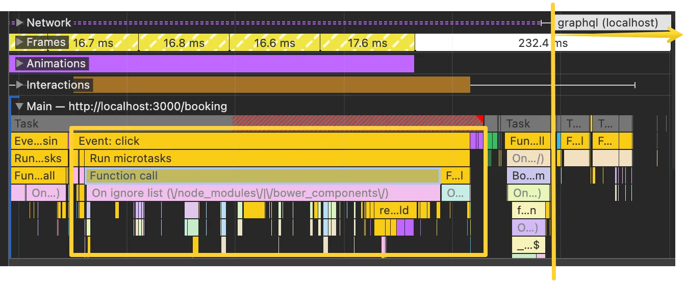

위의 mouse event가 일어나고 나서의 타임라인은 다음과 같습니다. 

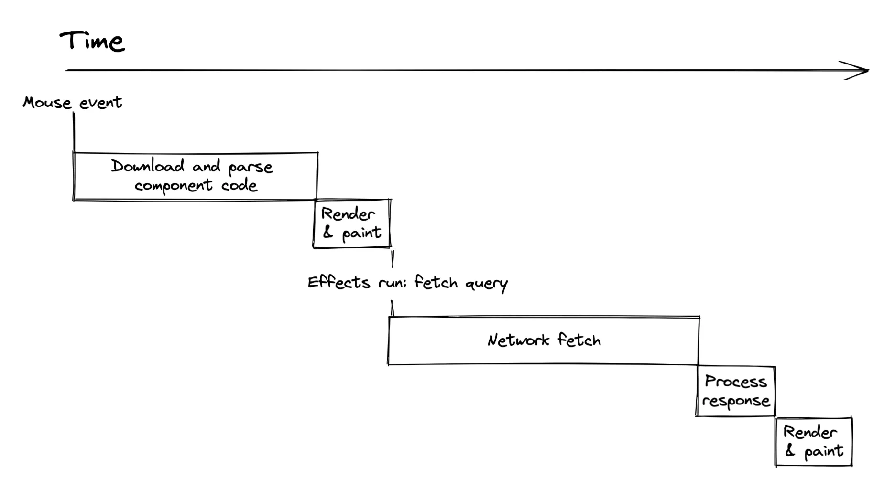

페칭 시점을 보면 클릭 이벤트가 일어나는 순간 페칭을 한다고 생각했지만, 실제 React 렌더링이 완료될 때까지 시작하지 않습니다. 

Relay에서의 useLazyQuery 를 사용했는데, 이 방식은 `fetch on render` 전략에 해당합니다. 즉, 사용자가 특정 상호작용을 하고, 그 결과로 컴포넌트가 렌더링되는 시점에 데이터 요청이 시작됩니다.

이 패턴은 직관적이지만, 치명적인 단점이 있습니다. 렌더링 단계가 끝나야 네트워크 요청이 시작되므로, 네트워크 레이턴시 + 렌더링 오버헤드가 그대로 누적됩니다. 서버의 TTFB가 길거나, 컴포넌트 렌더링 비용이 큰 경우 사용자는 “클릭 후 아무 반응 없는 공백 구간”을 경험하게 됩니다.

여기서 “데이터 요청을 꼭 렌더링 이후에 시작해야 하는가?” “조금 더 앞당겨서, 사용자의 상호작용과 동시에 요청을 날릴 수는 없을까?” 를 생각해 볼 수 있는데 이 지점에서 Facebook팀은 PreloadQuery 혹은 Render-as-you-fetch 전략을 내놓았습니다.

Relay의 `preloadQuery`는 데이터 페칭(Network I/O)과 리액트 렌더링(Rendering) 을 디커플링(decoupling)하는 전략입니다.

### Fetch-on-render

`Render-as-you-fetch`가 페칭과 리액트렌더링을 디커플링 한다면 `Fetch-on-render` 패턴에서는 데이터 페칭이 상태와 강하게 묶여 있다는 점입니다.

다음 코드를 보면 Relay의 데이터 페칭 훅인 `useLazyLoadQuery`가 `queryVariables` state와 강하게 묶여있는데 React는 상태 업데이트 → 리렌더링을 스케줄링하고, 리렌더링 과정에서 useLazyLoadQuery(queryVariables)가 다시 실행됩니다. queryVariables.date 값이 바뀌었으므로 새 쿼리 요청이 필요하다고 Relay가 판단합니다. 

useLazyLoadQuery를 더 빠른 시점인 `handleOnDayClick` 내부에 두면 렌더링 전에 실행 되지 않을까 하겠지만 useLazyLoadQuery는 훅이므로 컴포넌트 루트에 있어야 합니다. 그래서 렌더링 중에 반드시 실행됩니다. 따라서 렌더링과 데이터 요청(fetch)이 한 흐름에 묶여(fetch on render) 있습니다.

```tsx
export const BookingClassForm = () => {
  const [queryVariables, setQueryVariables] = useState({
    storeId: '1',
    date: DateTime.now().setZone('Asia/Seoul').toISODate(),
  })

  const data = useLazyLoadQuery<BookingQueryType>(
    BookingClassFormQuery,
    queryVariables
  )

  function handleOnDayClick(selected: Date) {
    
      setQueryVariables((prev) => ({
        ...prev,
        date: DateTime.fromJSDate(selected).setZone('Asia/Seoul').toISODate(),
      }))
    
  }

  return (
    <>
     
      <SelectDate
        onDayClick={handleOnDayClick}
        value={DateTime.fromISO(queryVariables.date).toJSDate()}
      />
      <Suspense fallback={<div>Loading...</div>}>
        <RegularClasses regularClasses={data.stores[0]} />
      </Suspense>
    </>
  )
}

```


### Render as you fetch

컴포넌트가 렌더되는 시점(render phase) 에 호출되어 그때(혹은 바로 직후) 네트워크 요청을 트리거하는 패턴 입니다. `useLazyLoadQuery` 훅의 한계였던 React 훅은 당연히 컴포넌트 최상단에서 호출해야 하는 제약을 개선할 수 있습니다. 

타임라인은 다음과 같습니다. 사용자가 화면에서 마우스 이벤트 동작을 하면, 필요한 데이터를 즉시 가져오면서 동시에 화면 표시 준비도 시작해야 합니다. 필요하다면 코드나 리소스도 미리 불러옵니다. 이 두 과정이 모두 완료되면, 데이터를 화면에 표시할 수 있습니다.

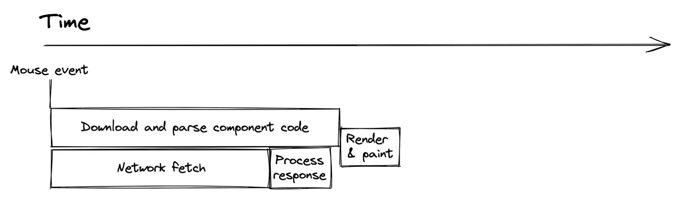


Relay팀에서 render as you fetch를 실현하는 loadQuery API의 아이디어는 렌더링과 페칭을 별도로 시작 합니다. 이게 가능한 이유는 loadQuery + usePreloadedQuery 로 구조적으로 제공하기 때문입니다.

 `loadQuery`를 사용하면, 화면이 아직 렌더링되기 전에도 네트워크 요청을 즉시 시작할 수 있습니다. 이때 반환되는 `QueryReference`는 단순한 데이터 “참조”이므로, 렌더링은 이를 기다리지 않고 진행할 수 있습니다.

```tsx
export const BookingClassFormQuery = graphql`
  query BookingClassFormQuery($storeId: String!, $date: Date!) {
    stores(where: { _id: $storeId }) {
      _id
      id
      description
      ...RegularClassesFragment @arguments(date: $date, after: null, first: 10)
    }
  }
`


export const BookingClassForm = () => {
  const [selectedDate, setSelectedDate] = useState('2024-01-01')

  // Relay 18 useQueryLoader 패턴
  const [queryRef, loadQuery, disposeQuery] = useQueryLoader<BookingQueryType>(
    BookingClassFormQuery
  )

 
  const handleTouchStart = (date: Date) => {
    console.log("touch start")
    const dateStr = DateTime.fromJSDate(date).setZone('Asia/Seoul').toISODate()!
    
    setSelectedDate(dateStr)
    // 즉시 쿼리 로드 시작 (render as you fetch!)
    loadQuery({
      storeId: '1',
      date: dateStr,
    })
  }

  // 실제 클릭 시 날짜 변경
  const handleDateClick = (date: Date) => {
    const dateStr = DateTime.fromJSDate(date).setZone('Asia/Seoul').toISODate()!
    console.log('🔥 DATE CLICK:', dateStr)
    startTransition(() => {
      setSelectedDate(dateStr)
    })
  }

  // 현재 날짜를 메모이제이션
  const currentDate = useMemo(
    () => DateTime.fromISO(selectedDate).toJSDate(),
    [selectedDate]
  )

  return (
    <>
      {/* <StoreList queryRef={data} onChange={handleOnStoreClick} value={formik.values.store} /> */}

      <SelectDate
        // onDayClick={handleDateClick}
        onTouchStart={handleTouchStart}
        value={currentDate}
        isPending={isPending}
      />

      {/* Relay 18 Render as you fetch 패턴 */}
      {queryRef ? (
        <Suspense
          fallback={
            <div className="flex items-center justify-center p-4">
              <div className="animate-spin rounded-full h-6 w-6 border-b-2 border-blue-600"></div>
              <span className="ml-2 text-blue-600">
                클래스 데이터 로딩 중...
              </span>
            </div>
          }
        >
          <RegularClasses queryRef={queryRef} />
        </Suspense>
      ) : (
        <div className="flex items-center justify-center p-8">
          <span className="text-gray-500">날짜를 선택해주세요</span>
        </div>
      )}
    </>
  )
}


```

실제 performance를 분석한 결과, 터치 이벤트부터 fetchFn까지 6ms로 렌더링 완료를 기다리지 않고 이벤트 핸들러에서 직접 데이터 요청하는 부분을 확인할 수 있다. fetch-on-render의 한계였던 컴포넌트 렌더링이나 useEffect 대기 없이 이벤트 핸들러에서 바로 네트워크 요청이 시작되는 것을 확인할 수 있습니다.

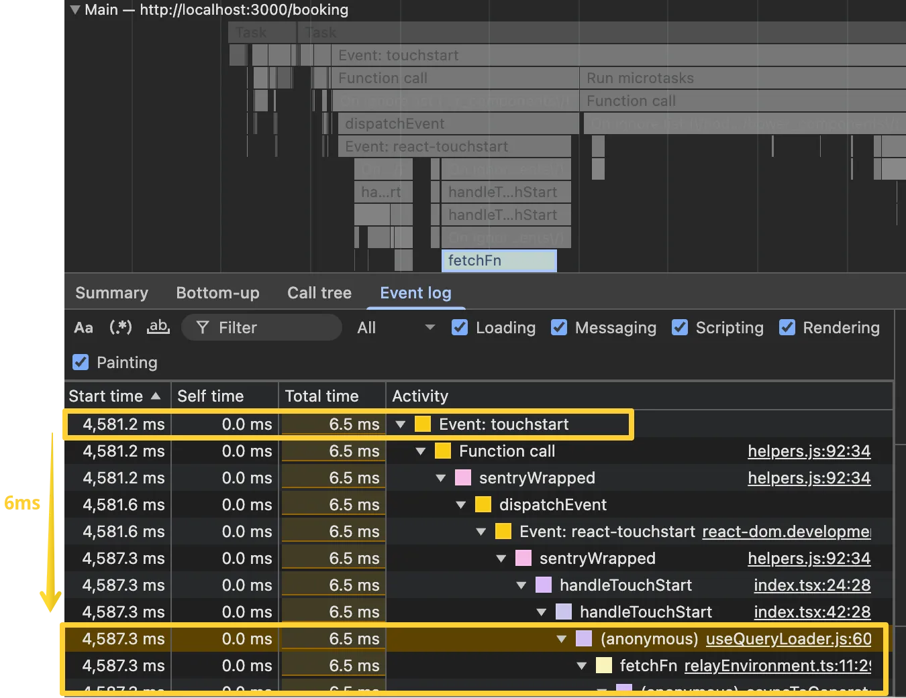


실제 commit 직후 한번 더 리렌더링 되면서 함수 컴포넌트가 호출된것을 확인할 수 있습니다.
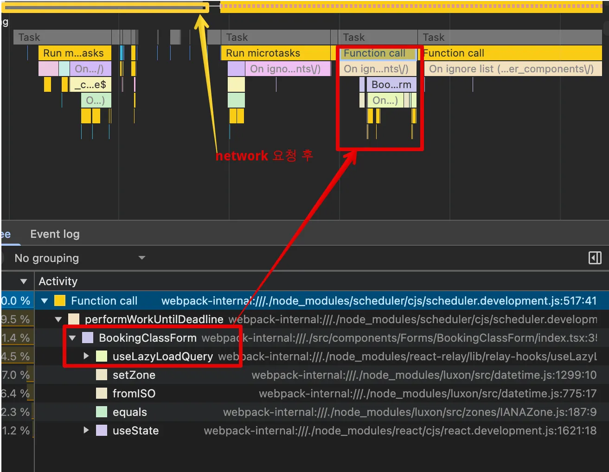


체감 로딩 시간은 다음과 같이 정의 할 수 있으며, 단축할 수 있는 수학적인 근거가 생깁니다.
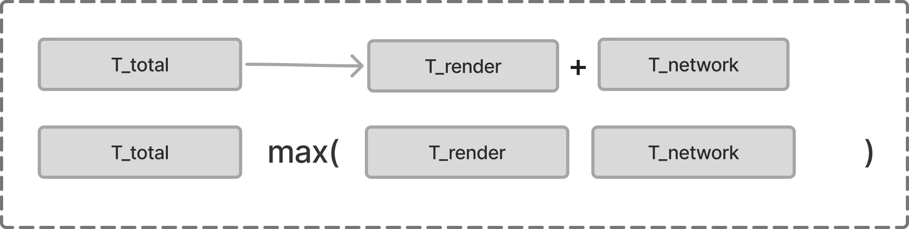


## ConcurrentMode에서 startTransition으로 Suspense 로딩 제어하기

[nielsen norman group](https://www.nngroup.com/articles/progress-indicators/) 의 연구 결과에 따르면, 1초 미만 로딩시 루프 애니메이션 사용 시 산만함을 유발하므로 사용 비권장한다고 했으며, 리액트 팀에서도 공식문서에 jarring experience에 대해 좋지 않은 사용자 경험으로 언급해왔습니다.

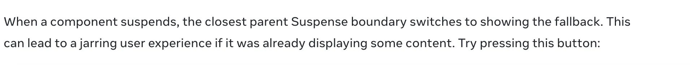

실제 앱에서도 이런 현상이 있었는데요, 너무 짧은 시간(예: 50~100ms)만 fallback이 노출돼도 깜빡임(flicker)으로 오히려 혼란 유발했습니다. 사용자는 앱이 불안정하다는 느낌을 받게 되고 피로감 증가와 이탈률 상승에 다다르게 되어 제품의 질에 부정적인 영향을 주게 됩니다.

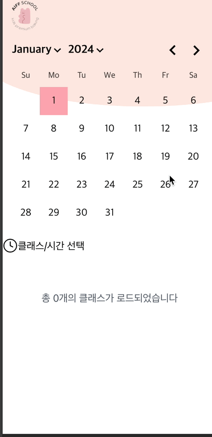


문제를 다시 살펴보겠습니다. suspense의 fallback 이 깜빡이는 것처럼 보이는 원인은 promise를 리턴하고 resolve가 되기까지의 시간이 100ms 이내의 짧은 시간에도 제어하지 못하고 그대로 fallback이 보여지기 때문입니다. 

React 팀이 제시하는 startTransition의 목적 중 하나는 실제로 이미 표시된 콘텐츠가 fallback으로 대체되는 jarring한 경험을 방지하는 것입니다.

>"Transitions prevent unwanted loading indicators, which lets the user avoid jarring jumps on navigation"

>"During a Transition, React will avoid hiding already revealed content"

그런데 비긴급 업데이트 처리를 위해 useTransition 사용이 어떻게 suspense의 loading indicator를 제어 할 수 있는지가 의문일 것입니다. 

useTransition은 동시성을 제대로 활용하기 위해 React팀에서 만든 API입니다.
Suspense 자체만으로는 동시성 렌더링을 구현하는 도구는 아닙니다. 

동시성 렌더링의 핵심은 다음 뷰를 렌더링하는 동안 현재 뷰가 응답성을 유지하도록 렌더링 프로세스를 재작업하는 것입니다. 여기서 다음 뷰를 렌더링 하는 동안 현재 뷰를


Concurrent Mode의 핵심 메커니즘 중 하나가 Lane 시스템입니다.
이유는 Lane에 따라 “이 업데이트를 언제, 어떤 우선순위로 실행할지”를 스케줄러에 의해 처리 되기 때문입니다. 

React는 업데이트를 여러 "Lane"으로 분류합니다. 그 중 이야기할 부분은 다음과 같습니다.

- SyncLane: 즉시 처리 (클릭, 입력 등)
- TransitionLane: 지연 가능한 업데이트

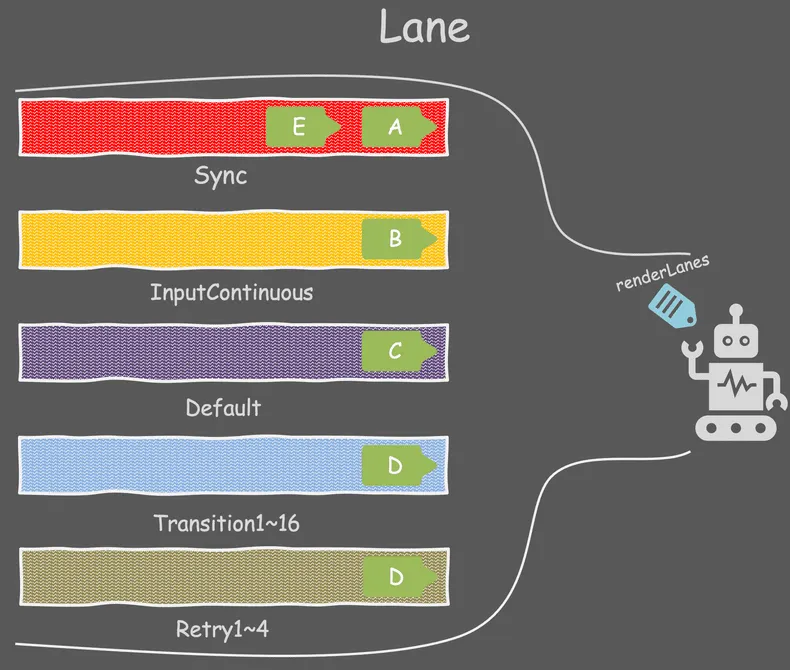

사용자가 이벤트를 발생시키고(setState, dispatchAction 등), React가 업데이트를 생성할 때 Fiber 노드의 lanes 필드에 기록됩니다.


React Fiber의 이중 버퍼링 시스템으로 React는 두 개의 Fiber Tree를 동시에 관리합니다.

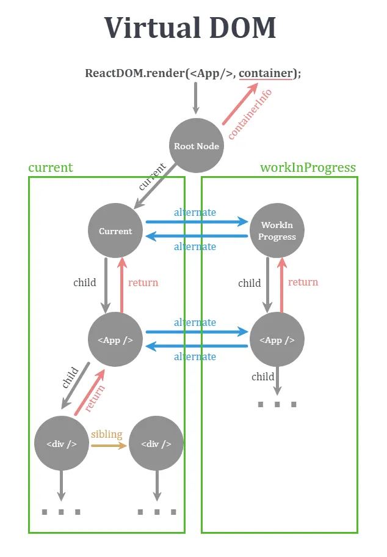

왼쪽의 current가 현재 유저가 보고있는 실제 브라우저의 dom이고, 오른쪽이 react의 `WorkInProgress` 트리 입니다. WorkInProgress Fiber에도 lanes가 그대로 복사됩니다. 


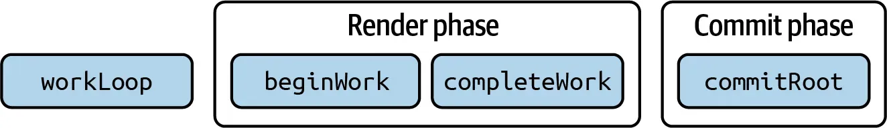

render 단계가 본격적으로 시작될 때 beginWork → updateSuspenseComponent 같은 함수들이 실행될 때,
현재 처리 중인 Lane과 해당 Fiber의 lanes를 비교해서 **이 Fiber를 다시 렌더링해야 하는지(skip할지)**를 결정합니다.
이미지와 같이, startTransition이 없으면, 긴급작업으로 간주됩니다. 

`completeWork`에서는 커밋할 새 트리를 구성하는 역할을 하는데, 여기서 해당 주석을 통해 리액트팀에서 어쩔 수 없이 기존 콘텐츠를 숨기고 fallback을 보여줘야 하는 상황이면, 최대한 오래 기다리자는 의도를 알 수 있습니다.

```tsx {1,3-5}
//react/packages/react-reconciler/src/ReactFiberCompleteWork.new.js
function completeWork(
  current: Fiber | null,
  workInProgress: Fiber,
  renderLanes: Lanes,
): Fiber | null {
  const newProps = workInProgress.pendingProps;
  // Note: This intentionally doesn't check if we're hydrating because comparing
  // to the current tree provider fiber is just as fast and less error-prone.
  // Ideally we would have a special version of the work loop only
  // for hydration.
  popTreeContext(workInProgress);
  switch (workInProgress.tag) {
    case IndeterminateComponent:
    case LazyComponent:
    case SimpleMemoComponent:
    case FunctionComponent:
    case ForwardRef:
    case Fragment:
    case Mode:
    case Profiler:
    case ContextConsumer:
    case MemoComponent:
      bubbleProperties(workInProgress);
      return null;
   
    ...
    ...
    ...
 case SuspenseComponent: {
      popSuspenseContext(workInProgress);
      const nextState: null | SuspenseState = workInProgress.memoizedState;

      // Special path for dehydrated boundaries. We may eventually move this
      // to its own fiber type so that we can add other kinds of hydration
      // boundaries that aren't associated with a Suspense tree. In anticipation
      // of such a refactor, all the hydration logic is contained in
      // this branch.
      if (
        current === null ||
        (current.memoizedState !== null &&
          current.memoizedState.dehydrated !== null)
      ) {
        const fallthroughToNormalSuspensePath = completeDehydratedSuspenseBoundary(
          current,
          workInProgress,
          nextState,
        );
        if (!fallthroughToNormalSuspensePath) {
          if (workInProgress.flags & ShouldCapture) {
            // Special case. There were remaining unhydrated nodes. We treat
            // this as a mismatch. Revert to client rendering.
            return workInProgress;
          } else {
            // Did not finish hydrating, either because this is the initial
            // render or because something suspended.
            return null;
          }
        }

        // Continue with the normal Suspense path.
      }

      if ((workInProgress.flags & DidCapture) !== NoFlags) {
        // Something suspended. Re-render with the fallback children.
        workInProgress.lanes = renderLanes;
        // Do not reset the effect list.
        if (
          enableProfilerTimer &&
          (workInProgress.mode & ProfileMode) !== NoMode
        ) {
          transferActualDuration(workInProgress);
        }
        // Don't bubble properties in this case.
        return workInProgress;
      }

      const nextDidTimeout = nextState !== null;
      const prevDidTimeout =
        current !== null &&
        (current.memoizedState: null | SuspenseState) !== null;

      if (enableCache && nextDidTimeout) {
        const offscreenFiber: Fiber = (workInProgress.child: any);
        let previousCache: Cache | null = null;
        if (
          offscreenFiber.alternate !== null &&
          offscreenFiber.alternate.memoizedState !== null &&
          offscreenFiber.alternate.memoizedState.cachePool !== null
        ) {
          previousCache = offscreenFiber.alternate.memoizedState.cachePool.pool;
        }
        let cache: Cache | null = null;
        if (
          offscreenFiber.memoizedState !== null &&
          offscreenFiber.memoizedState.cachePool !== null
        ) {
          cache = offscreenFiber.memoizedState.cachePool.pool;
        }
        if (cache !== previousCache) {
          // Run passive effects to retain/release the cache.
          offscreenFiber.flags |= Passive;
        }
      }

      // If the suspended state of the boundary changes, we need to schedule
      // a passive effect, which is when we process the transitions
      if (nextDidTimeout !== prevDidTimeout) {
        if (enableTransitionTracing) {
          const offscreenFiber: Fiber = (workInProgress.child: any);
          offscreenFiber.flags |= Passive;
        }

        // If the suspended state of the boundary changes, we need to schedule
        // an effect to toggle the subtree's visibility. When we switch from
        // fallback -> primary, the inner Offscreen fiber schedules this effect
        // as part of its normal complete phase. But when we switch from
        // primary -> fallback, the inner Offscreen fiber does not have a complete
        // phase. So we need to schedule its effect here.
        //
        // We also use this flag to connect/disconnect the effects, but the same
        // logic applies: when re-connecting, the Offscreen fiber's complete
        // phase will handle scheduling the effect. It's only when the fallback
        // is active that we have to do anything special.
        if (nextDidTimeout) {
          const offscreenFiber: Fiber = (workInProgress.child: any);
          offscreenFiber.flags |= Visibility;

          // TODO: This will still suspend a synchronous tree if anything
          // in the concurrent tree already suspended during this render.
          // This is a known bug.
          if ((workInProgress.mode & ConcurrentMode) !== NoMode) {
            // TODO: Move this back to throwException because this is too late
            // if this is a large tree which is common for initial loads. We
            // don't know if we should restart a render or not until we get
            // this marker, and this is too late.
            // If this render already had a ping or lower pri updates,
            // and this is the first time we know we're going to suspend we
            // should be able to immediately restart from within throwException.
            const hasInvisibleChildContext =
              current === null &&
              (workInProgress.memoizedProps.unstable_avoidThisFallback !==
                true ||
                !enableSuspenseAvoidThisFallback);
            if (
              hasInvisibleChildContext ||
              hasSuspenseContext(
                suspenseStackCursor.current,
                (InvisibleParentSuspenseContext: SuspenseContext),
              )
            ) {
              // If this was in an invisible tree or a new render, then showing
              // this boundary is ok.
              renderDidSuspend();
            } else {
              // Otherwise, we're going to have to hide content so we should
              // suspend for longer if possible.
              renderDidSuspendDelayIfPossible();
            }
          }
        }
      }


```

renderDidSuspendDelayIfPossible 함수는 상태를 `RootSuspendedWithDelay` 로 만듭니다.

```tsx
export function renderDidSuspendDelayIfPossible(): void {
  if (
    workInProgressRootExitStatus === RootInProgress ||
    workInProgressRootExitStatus === RootSuspended ||
    workInProgressRootExitStatus === RootErrored
  ) {
    workInProgressRootExitStatus = RootSuspendedWithDelay;
This is a global variable holding the result of full re-render

  }


```

실제 commit 이 있기전 `finishConcurrentRender` 함수를 통해 commit을 합니다. 

위에서 가져온 exitStatus를 바탕으로 RootSuspendedWithDelay 상태일 때 처리를 보겠습니다.

Transition 업데이트라면, React는 fallback을 절대 커밋하지 않습니다. 타임아웃도 걸지 않습니다. 따라서 기존 UI는 그대로 유지되고, 새로운 데이터가 들어올 때만 새로운 화면으로 교체합니다.


```tsx
//react/packages/react-reconciler/src/ReactFiberWorkLoop.new.js

function finishConcurrentRender(root, exitStatus, lanes) {
  switch (exitStatus) {
    case RootInProgress:
    case RootFatalErrored: {
      throw new Error('Root did not complete. This is a bug in React.');
    }
    // Flow knows about invariant, so it complains if I add a break
    // statement, but eslint doesn't know about invariant, so it complains
    // if I do. eslint-disable-next-line no-fallthrough
    case RootErrored: {
      // We should have already attempted to retry this tree. If we reached
      // this point, it errored again. Commit it.
      commitRoot(
        root,
        workInProgressRootRecoverableErrors,
        workInProgressTransitions,
      );
      break;
    }
    case RootSuspended: {
      markRootSuspended(root, lanes);

      // We have an acceptable loading state. We need to figure out if we
      // should immediately commit it or wait a bit.

      if (
        includesOnlyRetries(lanes) &&
        // do not delay if we're inside an act() scope
        !shouldForceFlushFallbacksInDEV()
      ) {
        // This render only included retries, no updates. Throttle committing
        // retries so that we don't show too many loading states too quickly.
        const msUntilTimeout =
          globalMostRecentFallbackTime + FALLBACK_THROTTLE_MS - now();
        // Don't bother with a very short suspense time.
        if (msUntilTimeout > 10) {
          const nextLanes = getNextLanes(root, NoLanes);
          if (nextLanes !== NoLanes) {
            // There's additional work on this root.
            break;
          }
          const suspendedLanes = root.suspendedLanes;
          if (!isSubsetOfLanes(suspendedLanes, lanes)) {
            // We should prefer to render the fallback of at the last
            // suspended level. Ping the last suspended level to try
            // rendering it again.
            // FIXME: What if the suspended lanes are Idle? Should not restart.
            const eventTime = requestEventTime();
            markRootPinged(root, suspendedLanes, eventTime);
            break;
          }

          // The render is suspended, it hasn't timed out, and there's no
          // lower priority work to do. Instead of committing the fallback
          // immediately, wait for more data to arrive.
          root.timeoutHandle = scheduleTimeout(
            commitRoot.bind(
              null,
              root,
              workInProgressRootRecoverableErrors,
              workInProgressTransitions,
            ),
            msUntilTimeout,
          );
          break;
        }
      }
      // The work expired. Commit immediately.
      commitRoot(
        root,
        workInProgressRootRecoverableErrors,
        workInProgressTransitions,
      );
      break;
    }
    case RootSuspendedWithDelay: {
      markRootSuspended(root, lanes);

      if (includesOnlyTransitions(lanes)) {
        // This is a transition, so we should exit without committing a
        // placeholder and without scheduling a timeout. Delay indefinitely
        // until we receive more data.
        break;
      }

      if (!shouldForceFlushFallbacksInDEV()) {
        // This is not a transition, but we did trigger an avoided state.
        // Schedule a placeholder to display after a short delay, using the Just
        // Noticeable Difference.
        // TODO: Is the JND optimization worth the added complexity? If this is
        // the only reason we track the event time, then probably not.
        // Consider removing.

        const mostRecentEventTime = getMostRecentEventTime(root, lanes);
        const eventTimeMs = mostRecentEventTime;
        const timeElapsedMs = now() - eventTimeMs;
        const msUntilTimeout = jnd(timeElapsedMs) - timeElapsedMs;

        // Don't bother with a very short suspense time.
        if (msUntilTimeout > 10) {
          // Instead of committing the fallback immediately, wait for more data
          // to arrive.
          root.timeoutHandle = scheduleTimeout(
            commitRoot.bind(
              null,
              root,
              workInProgressRootRecoverableErrors,
              workInProgressTransitions,
            ),
            msUntilTimeout,
          );
          break;
        }
      }

      // Commit the placeholder.
      commitRoot(
        root,
        workInProgressRootRecoverableErrors,
        workInProgressTransitions,
      );
      break;
    }
    case RootCompleted: {
      // The work completed. Ready to commit.
      commitRoot(
        root,
        workInProgressRootRecoverableErrors,
        workInProgressTransitions,
      );
      break;
    }
    default: {
      throw new Error('Unknown root exit status.');
    }
  }
}
```


앞서 설명한 React 내부 동작을 실제 코드로 검증해보겠습니다.


```tsx
const handleTouchStart = (date: Date) => {
  const dateStr = DateTime.fromJSDate(date).setZone('Asia/Seoul').toISODate()!
  
  // 문제가 되는 패턴
  startTransition(() => {
    setSelectedDate(dateStr) // Transition 업데이트
  })
  
  loadQuery({
    storeId: '1',
    date: dateStr, // Urgent 업데이트 (즉시 Suspense 트리거)
  })
}

```


이 코드에서 `loadQuery`는 startTransition 밖에서 실행되므로 urgent 업데이트로 처리됩니다. React의 `finishConcurrentRender` 함수에서 `RootSuspendedWithDelay` 상태가 되었을 때, `includesOnlyTransitions(lanes)` 체크를 통과하지 못합니다.

```tsx
// finishConcurrentRender 내부
case RootSuspendedWithDelay: {
  if (includesOnlyTransitions(lanes)) {
    // 이 분기로 들어가지 못함
    break; // fallback 커밋 안함
  }
  
  // 여기로 진행되어 fallback 커밋
  commitRoot(root, workInProgressRootRecoverableErrors, workInProgressTransitions);
}

```
결과적으로 includesOnlyTransitions(lanes)가 false를 반환하여 fallback이 커밋됩니다.

모든 업데이트를 transition내부로 옮깁니다.

```tsx
const handleTouchStart = (date: Date) => {
  const dateStr = DateTime.fromJSDate(date).setZone('Asia/Seoul').toISODate()!
  
  // 모든 업데이트를 transition 내부로
  startTransition(() => {
    setSelectedDate(dateStr)
    loadQuery({
      storeId: '1',
      date: dateStr,
    })
  })
}

```
이렇게 하면 두 업데이트 모두 동일한 transition lane에서 처리되어 `includesOnlyTransitions(lanes)`가 true를 반환합니다.

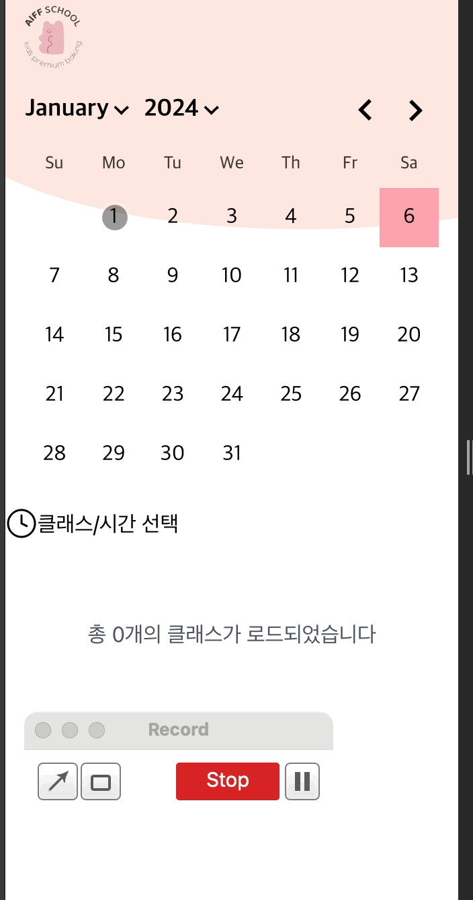


이제 Double Buffering 구조를 통해 사용자는 매끄러운 전환을 경험할 수 있습니다. 
Double Buffering은 commit 단계에서 WIP Fiber Tree와 Current를 교체 합니다.

transition이 없는 경우는 우선순위가 높기 때문에, WIP에서 생성된 fallback을 가능한 빨리 Commit해서 Current를 새 Tree로 교체 합니다. 

반면, transition이 있는 경우는 호출순위가 낮으므로 기존 current를 유지하고 WIP를 백그라운드에서 준비 합니다. 이 때 fallback이 WIP에 존재하지만 Current에는 없습니다. Promise가 resolve되는 시점에 Commit단계 에서 Current와 교체 합니다. 

```tsx
//commitRoot
root.current = finishedWork;
```
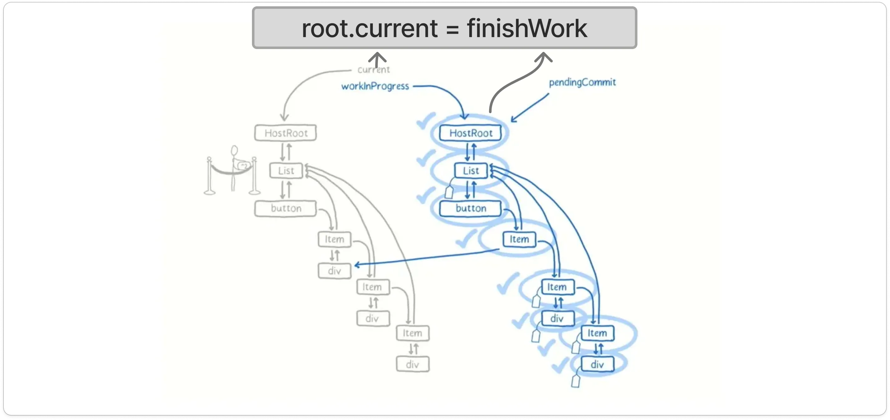


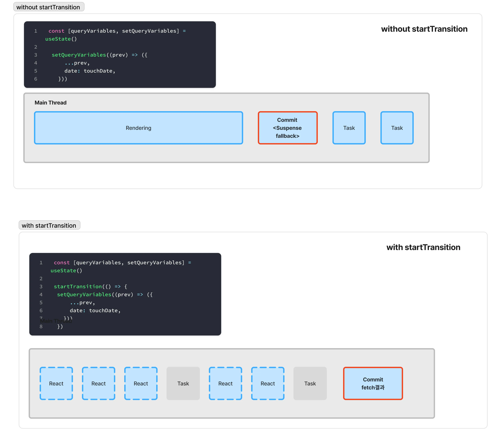


### 불필요한 Suspense Fallback을 피하는 방법으로 정말 transition이 최선일까?

비동기 응답 시간을 인위적으로 2초로 지연시켜 실험해보면, startTransition을 사용했을 때 기존 UI가 그대로 유지됩니다. 하지만 이 경우 사용자가 클릭 후 화면에 가시적인 변화가 없어 “반응이 없는 것 같다”는 인상을 받을 수 있습니다. 이는 Interaction to Next Paint(INP) 측정에도 부정적으로 작용할 수 있는데, 이벤트 발생 직후 시각적 피드백이 지연되기 때문입니다.


## 마무리

공식문서를 보며 startTransition이 어떻게 Suspense의 fallback을 방지하는지, 이것이 왜 가능한지 오랫동안 궁금해왔습니다. 이번 탐구를 통해 React 팀이 내부적으로 jarring한 경험을 방지하기 위해 더블 버퍼링 구조와 조건부 commit을 활용한다는 사실을 알게 되었습니다.하지만 중간에 놓친 부분도 많았다고 생각합니다. 관련 토픽들을 더 탐구해보면서 더 알아봐야겠지만 저의 분석으로는 finishConcurrentRender에서 includesOnlyTransitions(lanes) 체크를 통해 fallback을 포함한 WIP 트리의 commit을 지연시키고, 실제 데이터가 준비될 때까지 기존 Current 트리를 유지하는 메커니즘을 알게 되었습니다.


## References

https://jser.dev/2023-05-19-how-does-usetransition-work/
https://react.dev/reference/react/Suspense#preventing-already-revealed-content-from-hiding
https://blog.elijahlopez.ca/posts/react-how-to-add-minimum-loading-delay/
https://github.com/facebook/react/blob/v18.2.0/packages/react-reconciler/src/ReactFiberWorkLoop.new.js
https://vercel.com/blog/how-react-18-improves-application-performance