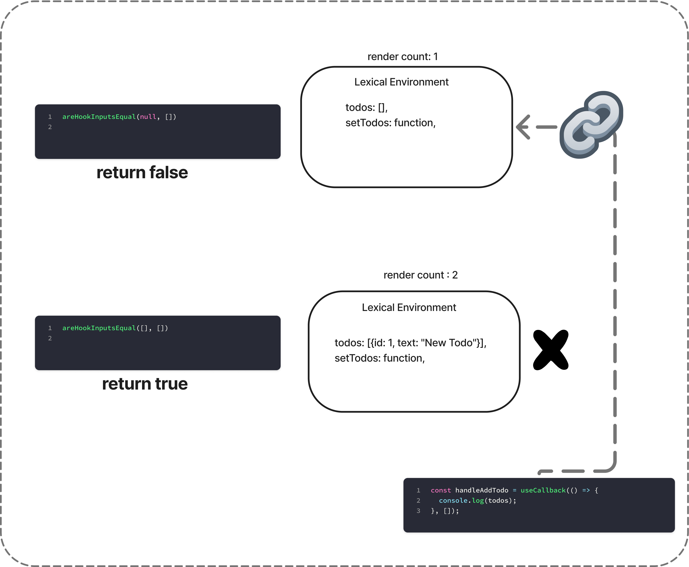

간단한 컴포넌트의 경우 useCallback 사용으로 동작에 혼란을 주진 않습니다. 하지만, 컴포넌트가 복잡해지고 컴포넌트 코드들을 넘나들며 확인해야 하는 경우 기대와 다른 동작을 하는 경우도 마주합니다.
여기에 의존성 배열도 빼놓을 수 없습니다. 그래서 의존성 배열 비교 원리를 리액트 소스코드를 통해 알아보고 useCallback에 대해 더 자세히 알고자 합니다. 

 
## 엔진의 스코프 체인 탐색 

실제 자바스크립트 엔진이 처리하는 방식을 그대로 적용해 보겠습니다.


```tsx

function TodoApp() {
  	const [todos, setTodos] = useState([]); // 메모리 주소: 0x001

	// JavaScript 엔진이 함수를 파싱할 때
	const handleAddTodo = useCallback(() => {
  		console.log(todos); // 👈 엔진: "todos? 어디서 찾지?"
	}, []);


}

```
 1. 함수 내부 스코프: todos 없음
 2. 바로 위 스코프 (TodoApp): todos 있음! ← 발견
 3. 이 todos를 함수와 "연결"
엔진은 스코프 체인을 탐색하게 됩니다.

`handleAddTodo` 스코프부터 참조할수 있는 todos를 찾아 상위스코프로 올라가고 TodoApp함수 스코프 내의 `todos` 를 찾을 수 있습니다.

```tsx

// 엔진이 보는 스코프 구조
Global Scope {
  TodoApp: function() {
    Local Scope {
      todos: [메모리 참조],
      setTodos: [함수 참조],
      handleAddTodo: function() {
        // 이 함수는 상위 스코프의 todos를 "참조"
        console.log(todos); // ← 스코프 체인으로 찾음
      }
    }
  }
}
```

클로저는 [tkdodo의 Hooks, Dependencies and Stale Closures](https://tkdodo.eu/blog/hooks-dependencies-and-stale-closures) 나 많은곳에서 캡처링을 사진찍기에 비유하는데 **사진의 중요한 점은, 바꿀 수 없다는 것입니다. 일단 사진을 찍으면 그 내용은 봉인됩니다.**

그래서 함수를 호출한다는 것은 그림을 보고 그 안에 있는 작업을 수행하는 것이고, 함수가 생성되는 것은 이전 그림을 버리고 새로운 그림을 그리는 것입니다. 

마찬가지로 todo 상태가 업데이트 되면 TodoApp 컴포넌트가 다시 렌더링 되므로, `handleAddTodo` 
함수가 생성됩니다. 그럼 handleAddTodo 함수는 업데이트된 `todos`를 캡쳐링해 최신 todo와 리스트를 예상한 대로 얻을 수 있습니다.

그런데 useCallback 메모이제이션이 붙게 되면, 앞서 언급한 캡처링처럼 동작하지 않습니다.


## useCallback과 클로저(Closure)의 관계

useCallback은 클로저(Closure)의 특성을 활용하여 동작합니다. 자바스크립트에서 함수는 자신이 선언될 당시의 환경(스코프)을 기억해요. 이 때문에 만약 useCallback의 의존성 배열에 값이 바뀌었는데도 함수를 재생성하지 않으면, 함수는 오래된 값(stale value)을 계속 참조하게 됩니다.


## useCallback의 dependency Array 동작원리 

react 소스 코드엔 `areHookInputEqual` 이라는 함수를 사용해 dependency array들을 처리합니다. 실질적으로 이전 dependency array와 현재 dependency array를 비교하는 로직은
마지막 for문,  `is(nextDeps[i], prevDeps[i])` 입니다. 


```tsx
/**
 * 
 * https://github.com/facebook/react/edit/main/packages/react-reconciler/src/ReactFiberHooks.js 453-501
 *  
 * */
import is from 'shared/objectIs';

function areHookInputsEqual(
  nextDeps: Array<mixed>,
  prevDeps: Array<mixed> | null,
): boolean {
  if (__DEV__) {
    if (ignorePreviousDependencies) {
      // Only true when this component is being hot reloaded.
      return false;
    }
  }

  if (prevDeps === null) {
    if (__DEV__) {
      console.error(
        '%s received a final argument during this render, but not during ' +
          'the previous render. Even though the final argument is optional, ' +
          'its type cannot change between renders.',
        currentHookNameInDev,
      );
    }
    return false;
  }

  if (__DEV__) {
    // Don't bother comparing lengths in prod because these arrays should be
    // passed inline.
    if (nextDeps.length !== prevDeps.length) {
      console.error(
        'The final argument passed to %s changed size between renders. The ' +
          'order and size of this array must remain constant.\n\n' +
          'Previous: %s\n' +
          'Incoming: %s',
        currentHookNameInDev,
        `[${prevDeps.join(', ')}]`,
        `[${nextDeps.join(', ')}]`,
      );
    }
  }
  // $FlowFixMe[incompatible-use] found when upgrading Flow
  for (let i = 0; i < prevDeps.length && i < nextDeps.length; i++) {
    // $FlowFixMe[incompatible-use] found when upgrading Flow
    if (is(nextDeps[i], prevDeps[i])) {
      continue;
    }
    return false;
  }
  return true;
}


```

prevDeps와 nextDeps 배열의 각 요소를 순차적으로 비교하여, 하나라도 다르면 false를 반환하고, 모든 요소가 같으면 true를 반환한다는 것을 알 수 있습니다.

## 실제 의존성 배열 비교 원리

ReactFiberHooks.js의 areHookInputsEqual 함수 내부를 보면 이 로직을 명확하게 이해할 수 있습니다.
`is` 함수는 React 내부에서 사용하는 Object.is의 polyfill입니다. Object.is는 JavaScript의 SameValue 알고리즘을 사용하여 두 값이 같은지 비교합니다. 


우선 prevDeps.length와 nextDeps.length가 같은지를 먼저 확인합니다. 그리고 길이가 같을 때만 for 루프를 돌면서 전체 배열을 비교합니다.

 함수 내부에 사용되는 것으로, 의존성 배열의 길이가 다르더라도 안정적으로 동작하게끔 설계된 부분입니다. 하지만 이 코드가 실행되기 전에 이미 길이 검사를 통해 대부분의 경우를 걸러내게 됩니다.

따라서 useCallback은 의존성 배열의 길이가 다르면 새로운 함수를 생성하며, 길이가 같을 때만 배열의 모든 요소를 순서대로 비교합니다.

여기서 중요한 것은 **React가 배열 자체의 참조를 비교하는 것이 아니라, 배열 내부의 각 요소를 비교한다는 점입니다.** 빈 배열의 경우 비교할 요소가 없으므로 항상 true 를 반환해 두개가 같다고 판단합니다. 같으면 새로운 함수를 생성하지 않고 memoization이 적용됩니다.

```ts
// https://github.com/facebook/react/blob/main/packages/shared/objectIs.js

/**
 * Copyright (c) Meta Platforms, Inc. and affiliates.
 *
 * This source code is licensed under the MIT license found in the
 * LICENSE file in the root directory of this source tree.
 *
 * @flow
 */

/**
 * inlined Object.is polyfill to avoid requiring consumers ship their own
 * https://developer.mozilla.org/en-US/docs/Web/JavaScript/Reference/Global_Objects/Object/is
 */
function is(x: any, y: any) {
  return (
    (x === y && (x !== 0 || 1 / x === 1 / y)) || (x !== x && y !== y) // eslint-disable-line no-self-compare
  );
}

const objectIs: (x: any, y: any) => boolean =
  // $FlowFixMe[method-unbinding]
  typeof Object.is === 'function' ? Object.is : is;

export default objectIs;


```

useCallback(fn, []) 처럼 빈 배열을 dependency로 사용하는 경우의 예를 보겠습니다.

```tsx

//===================== 첫 번째 렌더링 =======================
prevDeps = null
nextDeps = []
// prevDeps === null 이므로 return false → 새 함수 생성


//===================== 두번째 렌더링 =======================
prevDeps = []  // 이전에 저장된 빈 배열
nextDeps = []  // 새로운 빈 배열 (다른 메모리 주소)


// 하지만 areHookInputsEqual에서는...
for (let i = 0; i < 0 && i < 0; i++) {
  // 빈 배열이므로 for 루프 실행되지 않음
}
return true; // 비교할 요소가 없으므로 true 반환

```


## useCallback에서 Stale Closure가 발생하는 원리

이제 왜 useCallback(fn, [])에서 stale closure가 발생하는지 명확해집니다.
다음 코드와 이미지를 보면 이해가 좀 더 쉽습니다. 

```tsx
// 첫 번째 렌더링 - TodoApp 렉시컬 환경 V1
const TodoAppEnvironment_V1 = {
  todos: [],
  setTodos: function,
  // ...
};

const handleAddTodo = useCallback(() => {
  console.log(todos); // V1 환경의 todos ([]) 캡처
}, []); // 빈 의존성 배열

// React: handleAddTodo를 V1 환경과 함께 메모이제이션 저장

// 두 번째 렌더링 - TodoApp 렉시컬 환경 V2 
const TodoAppEnvironment_V2 = {
  todos: [{id: 1, text: "New Todo"}],
  setTodos: function,
  // ...
};

// areHookInputsEqual([], []) 호출
// → return true (빈 배열이므로 "변화 없음"으로 판단)
// → 기존 handleAddTodo 재사용 (여전히 V1 환경 참조)

```



결과적으로 handleAddTodo 함수는 첫 번째 렌더링 시점의 렉시컬 환경(V1)에 "고정"되어, 업데이트된 todos 상태에 접근할 수 없게 됩니다. 즉 stale closure의 정체입니다.


## 마무리

React의 useCallback은 성능 최적화를 위한 도구이지만, 잘못 사용하면 오히려 버그를 만들어내는 양날의 검입니다. dependency array를 올바르게 설정하는 것이 중요합니다. 의존성 배열을 비워두면 항상 첫 번째 렌더링 때의 값만 참조하게 되어 `오래된 클로저(Stale Closure)` 문제에 유의해야합니다. 


## References

- [Understanding useMemo and useCallback](https://www.joshwcomeau.com/react/usememo-and-usecallback/) 
- [Hooks, Dependencies and Stale Closures](https://tkdodo.eu/blog/hooks-dependencies-and-stale-closures) - (2022.04.24)
- [React useCallback Hook](https://react.dev/reference/react/useCallback) - React 공식 문서


