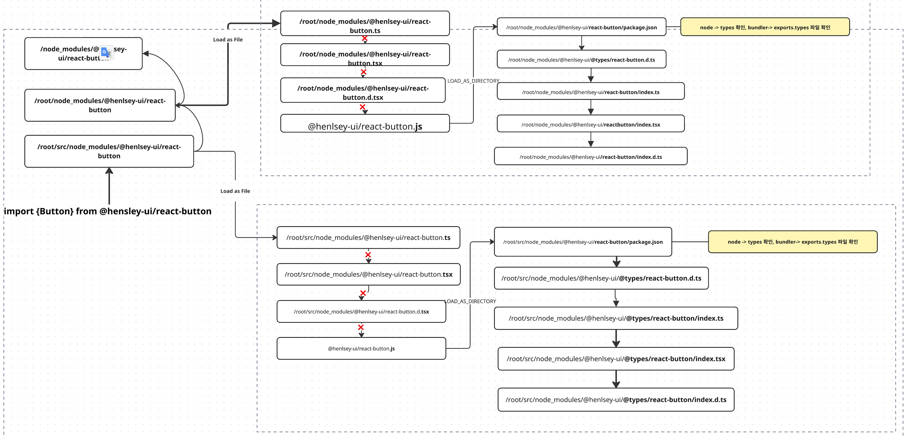
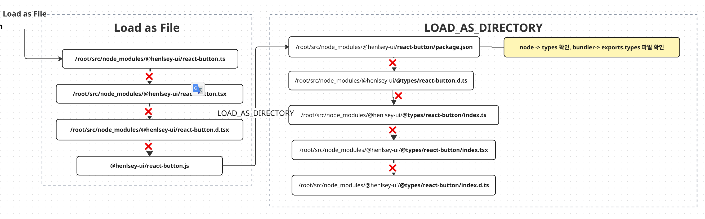
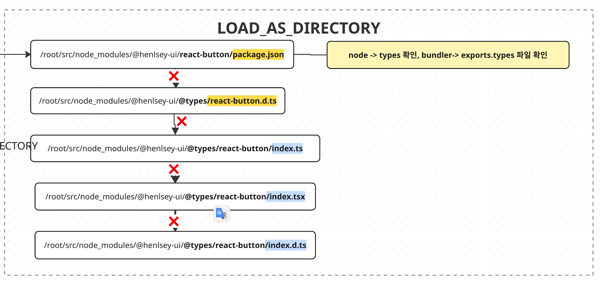
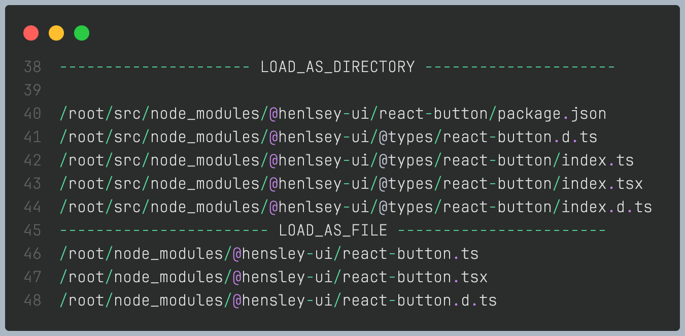
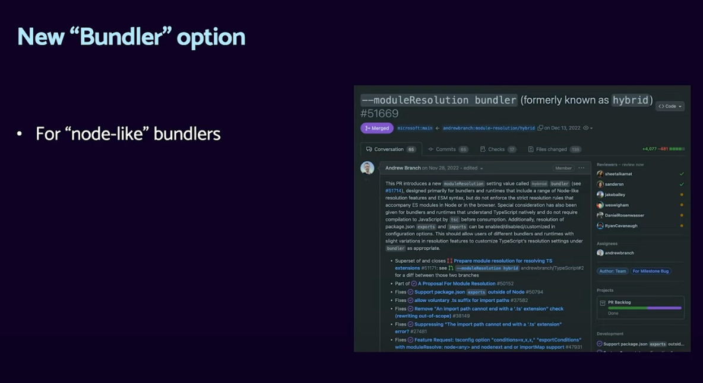
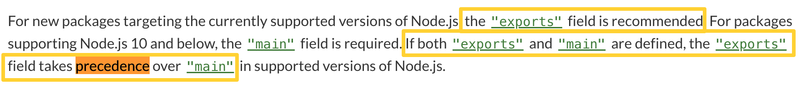
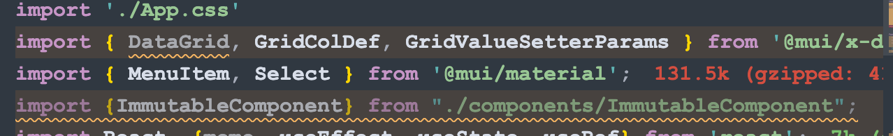
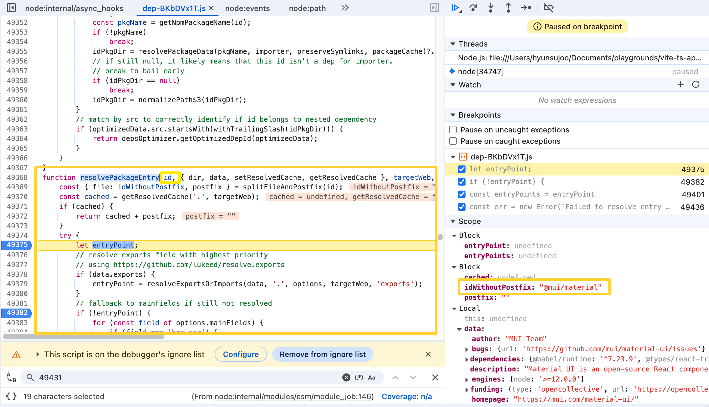
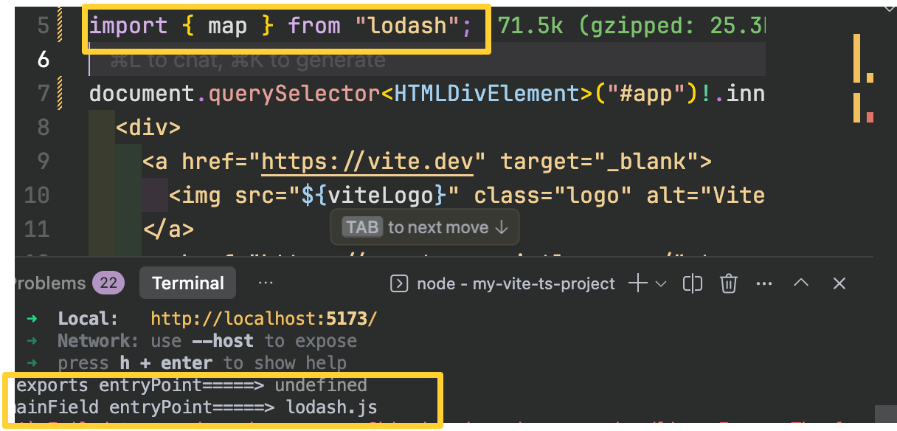

## 들어가면서 

배경은 최근 모노레포기반의 라이브러리를 배포했는데, vite react프로젝트에서 `module not found`에러를 발단으로 `import` 문을 vite와 TypeScript의 모듈 해석 알고리즘에 의해 어떻게 불러오는지, 그리고 TypeScript에서는 moduleResolution 설정에 왜 bundler를 지원하고, 앞으로 bundler로 적용해야 하는지 알 수 있습니다. 

## TypeScript Module Resolution Algorithm 

TypeScript의 moduleResolution 설정은 TypeScript 컴파일러가 import 구문을 만났을 때, 해당 모듈의 타입 정보를 찾기 위해 어떤 규칙을 사용할지를 정의합니다. 즉, TypeScript가 Fu의 타입을 알기 위해 Fubar라는 모듈의 타입 정의를 어디서 찾을지 결정하는 것이죠.

### Module Resolution Strategies

Node.js의 모듈 해석 규칙(node resolution)은 import나 require를 쓸 때 어떤 파일이 실제로 로드되는지를 결정하는 규칙입니다. TypeScript에서는 이 해석 규칙을 흉내 내기 위해 moduleResolution 옵션을 두었는데, 그중 "classic"은 Node.js 방식과 달리 단순하고 옛날 규칙을 의미합니다.

만약 `import { debounce } from "lodash"` 인 경우 node_modules까지 탐색을 하지 않고 대신 main.ts와 같은 폴더 또는 상대 경로에서 `lodash.ts` 같은 걸 찾으려고 하기 때문에 모듈을 못찾는 에러가 빈번히 있었습니다. 그래서 [Node](https://typescript-v2-527-ortam.vercel.app/docs/handbook/module-resolution.html#node) 규칙을 사용해 node_modules의 파일까지 찾을 수 있습니다. (node 모드)

[ - from typescript handbook module resolution](https://typescript-v2-527-ortam.vercel.app/docs/handbook/module-resolution.html#node)

>This resolution strategy attempts to mimic the Node.js module resolution mechanism at runtime. The full Node.js resolution algorithm is outlined in Node.js module documentation.


타입스크립트 5.0버전 이상부터는 `bundler` 도 포함이 되었는데, node 모드는 `exports` 존재 자체와 그 내부 구조를 인식하지 못하기 때문에, exports 맵 안에 정의된 types 필드에 정의된 파일 가져오기는 불가능합니다. 이런 문제를 해결하기 위해 TypeScript 5.0에서 bundler 모드 옵션이 추가되었습니다. 이 모드는 package.json의 imports 및 exports 조건을 포함해 최신 Node.js 모듈 기능과 번들러의 동작 방식을 정확하게 이해하고 지원합니다. 

제가 작성한 라이브러리`@hensley-ui/react-heading` 예를 들어 설명하자면, Non-Relative로 분리가 된 후, Node.js 모듈 해결 로직을 기반으로 한 LOAD_NODE_MODULES 알고리즘을 실행 합니다.


### 1.Relative vs Non-Relative Classification
모듈 import는 모듈 참조가 상대적인지 비상대적인지에 따라 다르게 해결됩니다. 상대적 import는 `/, ./` 또는 `../`로 시작하는 것입니다. 다른 모든 import는 비상대적으로 간주됩니다
여기서는 비상대적인 모듈 `@hensley-ui/react-heading`을 예로 설명하겠습니다. 


### 2. LOAD_AS_FILE


Node.js/TS는 import/require를 만났을 때 **이 이름을 파일로 볼지, 디렉터리로 볼지**를 판단하는 단계가 있습니다.

	•	Load as File - 모듈 이름이 가리키는 것이 파일인지 먼저 확인
	•	Load as Directory -모듈 이름이 가리키는 것이 폴더이면 패키지 진입점(package.json, index.js 등)을 찾아봄

즉, 순서가 항상 `File` -> `Directory` 입니다.





그래서 Load as File에서는 모듈 이름에 확장자를 붙여서 직접 파일이 존재하는지 여부 확인합니다.
이 때, 확장자에 따라 파일탐색 우선순위가 적용되어 탐색합니다. 여기서 성공하면, 굳이 `Load as Director` 인 디렉터리로 들어가서 index나 package.json을 확인할 필요가 없습니다.

```bash
1. /root/src/node_modules/@hensley-ui/react-button.ts
2. /root/src/node_modules/@hensley-ui/react-button.tsx
3. /root/src/node_modules/@hensley-ui/react-button.d.ts
```


### 3. LOAD_AS_DIRECTORY 
 LOAD_AS_FILE 과정에서 모든 파일에서 찾지 못했을 때, LOAD_AS_DIRECTORY 과정이 시작됩니다. 

 디렉터리 내부에 index 파일이나 package.json으로 정의된 진입점이 있을 수 있으므로 Directory 방식으로 탐색합니다.

여기서 중요한점은 tsconfig의 moduleResolution에 따라 해당 
단계에서 보는 부분이 달라집니다. 


`node`: `types` 를 가장 우선시 함 
`exports` :  `exports` 내 `types` 를 가장 우선시 함.


디렉토리에서 보는 핵심은, package.json파일을 확인해 types 파일을 확보하는 것입니다. 만약 없다면, `@types` 를 확인해보고, index파일을 확인합니다. 





index파일까지 확인했는데 못찾았다면 상위디렉토리에서 LOAD_AS_FILE 단계를 다시 순회합니다. 





TypeScript는 이렇게  .ts, .tsx, .d.ts 확장자 확인, package.json의 "types" 필드 지원, 타입 정의 파일 우선 순위를 추가로 확인하는 과정을 찾을 때 까지 상위 디렉토리로 올라가는데 만약 찾지 못한다면 에러를 내게 됩니다.


## Vite의 "node-like" 번들러 역할



이 파트에선 Vite가 TypeScript와는 다른 역할을 하지만, Vite와 같은 현대적인 번들러를 포함해 대부분은 Node.js의 최신 모듈 해석 규칙을 따른다는 점에서,moduleResolution 을 bundler로 적용해야 하는 이유를 알 수 있습니다.

### resolvePackageEntry

실제 Vite 소스코드에서도 [Node.js 공식문서](https://nodejs.org/api/packages.html)에서 언급 되었듯, 
exports와 main이 모두 있으면 exports가 우선시 되어야 하는 node규칙을 따르고 있습니다.

 

`if statement`의 `resolveExportsOrImports` 함수를 통해 얻은 entryPoint가 있으면 다른 필드를 더이상 확인하지 않고 넘어갑니다. 


```tsx {21-28}

export function resolvePackageEntry(
  id: string,
  { dir, data, setResolvedCache, getResolvedCache }: PackageData,
  options: InternalResolveOptions,
  externalize?: boolean,
): string | undefined {
  const { file: idWithoutPostfix, postfix } = splitFileAndPostfix(id)

  const cached = getResolvedCache('.', options)
  if (cached) {
    return cached + postfix
  }

  try {
    let entryPoint: string | undefined

    // resolve exports field with highest priority
    // using https://github.com/lukeed/resolve.exports
    if (data.exports) {
      entryPoint = resolveExportsOrImports(
        data,
        '.',
        options,
        'exports',
        externalize,
      )
    }

    // fallback to mainFields if still not resolved
    if (!entryPoint) {
      for (const field of options.mainFields) {
        if (field === 'browser') {
          entryPoint = tryResolveBrowserEntry(dir, data, options)
          if (entryPoint) {
            break
          }
        } else if (typeof data[field] === 'string') {
          entryPoint = data[field]
          break
        }
      }
    }
    entryPoint ||= data.main

    //...
    //...

    
  } catch (e) {
    packageEntryFailure(id, e.message)
  }
  packageEntryFailure(id)
}
```
 






만약 exports가 없는 lodash의 경우 main이 완전히 무시되는 것이 아니라 우선순위에서 밀리는 동작을 통해 `main` 필드로 entryPoint를 추출해 냄을 알 수 있습니다. 



그런데 해당 소스 코드를 통해 vite는 `types` 필드에 접근하지 않는걸 볼 수 있는데요. TypeScript의 모듈 해석 알고리즘에 전혀 관여하지 않음을 알 수 있습니다. 

### 번들러의 exports 필드 우선순위와 TypeScript moduleResolution 관계 
 
exports가 정의되면, Node.js와 번들러는 main, module 같은 기존 필드를 무시하고 exports를 최우선으로 참조합니다. 이 로직은 Node.js의 `resolveExportsOrImports` 함수에서도 확인할 수 있었습니다.

만약 외부 라이브러리는 exports로만 내보내기를 했고, 내 프로젝트의 moduleResolution 설정이 `node`일 경우
vite는 exports를 이용해 entry point를 찾았지만, TypeScript 진영에서는 exports에 접근하지 못하는 경우가 생깁니다. 

특히, exports 맵에서는 CommonJS(CJS)와 ECMAScript Modules(ESM) 환경에 따라 다른 타입 정의 파일(d.ts 파일)을 조건부로 내보내도록 설정할 수 있는데, node 모드에서는 이러한 조건부 타입 맵을 올바르게 이해하지 못합니다

결과적으로, Vite 같은 번들러는 exports 기반으로 진입점을 잘 찾는데, TS는 여전히 main이나 module에 의존하려 하면서 타입 불일치 문제가 생깁니다. 

만약 moduleResolution을 `node16`으로 설정하면, Node.js ESM 규칙에 따라 상대 경로에서 파일 확장자를 반드시 명시해야 합니다. 반면, bundler 모드에서는 Vite 같은 번들러가 확장을 자동으로 추론하기 때문에, exports 기반 진입점과 타입 정의를 더 유연하게 참조할 수 있습니다.

따라서 Vite 같은 번들러와 함께 사용한다면, TypeScript의 moduleResolution을 bundler로 설정하는 것이 exports 기반 진입점을 올바르게 해석하고 타입 불일치 문제를 방지하는 안전한 방법입니다.

###  exports가 없는 경우: mainFields 처리

앞서 설명했듯이, Vite와 Node.js는 exports를 최우선으로 참조합니다.
그렇다면 exports가 정의되어 있지 않은 경우에는 어떻게 될까요?
Vite는 설정된 mainFields 배열에 따라 순서대로 진입점을 탐색합니다.
예를 들어 기본 설정에서는 'browser' → 'module' → 'jsnext:main' → 'jsnext' 순으로 확인하며, package.json의 해당 필드 중 존재하는 첫 번째를 선택합니다.

```bash
  typescript// Vite의 기본 mainFields 설정
  const mainFields = [
    'browser',      // 1순위: 브라우저 환경
    'module',       // 2순위: ES Modules  
    'jsnext:main',  // 3순위: 레거시 ESM
    'jsnext'        // 4순위: 레거시 ESM
  ]
  실제 동작 예시
  json// package.json
  {
    "browser": "dist/browser.js",    // ✅ 1순위로 선택됨
    "module": "dist/esm.js",         // ← 스킵됨  
    "main": "dist/cjs.js"            // ← 스킵됨
  }
```
### 실제 파일이 존재하는지 확인 


아래 예시와 코드처럼 실제 동작 로직도 확인할 수 있습니다.
이 과정을 통해 구버전 라이브러리나 레거시 필드(main/module)를 지원할 수 있습니다.
```typescript
단계: mainFields - 설정 가능한 우선순위 체계
typescript// 2순위: mainFields 설정에 따른 필드들 (browser, module, main 등)
if (!entryPoint) {
  for (const field of options.mainFields) {
    // browser 필드는 특별 처리
    if (field === 'browser') {
      entryPoint = tryResolveBrowserEntry(dir, data, options)
    } else if (typeof data[field] === 'string') {
      entryPoint = data[field]  // module, main 등
      break
    }
  }
}


```


### 라이브러리 제작자 관점에서 package.json을 어떻게 작성해야할까? 

#### exports를 이용한 ESM 지원만으로 충분할까?

Node.js 12+ (특히 14 이상)부터는 exports가 정식 지원되었고, Vite, Rollup, Webpack 등 최신 번들러는 exports를 우선적으로 사용합니다. 만약 사용자의 moduleResolution설정이 `bundler`, `nodenext` 라면 TypeScript도 exports 안의 "types" 맵을 인식할 수 있습니다.


#### 그런데 왜 main, module, types를 남기는 경우가 많을까?

일부 구버전 툴링은 exports를 인식하지 못하고 main/module만 찾음.
예: 오래된 Jest, Storybook, Webpack 버전 등
	•	타입 해석기:
	•	TS 4.7 이전 버전은 `exports.types`를   제대로 지원하지 않음.
	•	따라서 types 필드를 남겨둬야 TS가 타입을 잘 찾을 수 있음.
	•	개발자 경험:
	•	일부 IDE(특히 오래된 버전)는 여전히 main이나 types를 먼저 보려고 함.

조금이라도 backward compatibility 고려한다면 main, module, types를 같이 둬서 안전망 확보하는것이 좋습니다.
